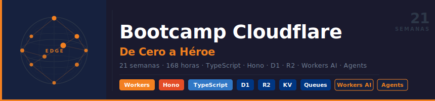

<p align="center">
  
</p>

# Cloudflare Bootcamp — Zero to Hero

<!-- Badges -->


[Versión en Español](README.md)

---

## 📋 Description

Intensive **21-week (~5-month)** bootcamp designed to take students from zero to
**Cloudflare Developer Junior**, with emphasis on Workers and the most recent
platform changes (2024–2026). The approach is 100% practical: each week
combines concise theory, guided exercises, and an integrative project adapted
to the student's assigned domain.

> 🏛️ **Unique Domain Policy (Anti-copying):** Each student works on a unique
> business domain assigned by the instructor. This ensures original
> implementations and prevents copying between peers.

### 🎯 Objectives

Upon completing the bootcamp, students will be able to:

- ✅ Deploy Workers to production with Wrangler 3 and CI/CD (GitHub Actions)
- ✅ Design type-safe APIs with Hono v4 and TypeScript at the edge
- ✅ Persist data with D1 (DrizzleORM), KV, R2, Durable Objects, and Hyperdrive
- ✅ Process asynchronous events with Queues and orchestrate with Workflows
- ✅ Build RAG pipelines using Workers AI, Vectorize, and AI Gateway
- ✅ Build AI Agents with persistent memory and MCP integration
- ✅ Implement Service Bindings with type-safe RPC between Workers
- ✅ Operate multi-tenant platforms with Workers for Platforms
- ✅ Observe, test, and secure Workers in production

### 🚀 Why Cloudflare Workers?

> **Workers first** — the right order for learning the edge in 2026.

This bootcamp teaches **Workers from the start** as a unified platform:
compute, store, queue, orchestrate, and infer within the same runtime.
Cloudflare Pages is in maintenance mode; Workers (with Assets) is the
destination for all new projects.

The acquisition of **Astro** (January 2026) and official sponsorship of
**TanStack** make this stack Cloudflare's long-term bet for web development.

---

## 🗓️ Bootcamp Structure

| Stage | Weeks | Hours | Emphasis |
|-------|-------|-------|----------|
| Stage 0 — Edge Fundamentals | 1–4 | 32h | CF network, Wrangler 3, Workers runtime, KV |
| Stage 1 — Persistence & Data | 5–9 | 40h | D1, R2, Queues, Durable Objects, Hyperdrive |
| Stage 2 — AI at the Edge | 10–14 | 40h | Workers AI, Vectorize, AI Gateway, RAG, Agents |
| Stage 3 — Advanced Full-Stack | 15–18 | 32h | Pages/Assets, Service Bindings RPC, Workers for Platforms, Workflows |
| Stage 4 — Production & Platform | 19–21 | 24h | Observability, Security, Final Project |

**Total: 21 weeks · ~168 hours**

---

## 📚 Weekly Content

Each week includes:

```
bootcamp/week-XX-tema_principal/
├── README.md                 # Description and objectives
├── rubrica-evaluacion.md     # Evaluation criteria
├── 0-assets/                 # SVG diagrams (architecture, flows)
├── 1-teoria/                 # Theoretical material in markdown
├── 2-practicas/              # Guided exercises
│   └── ejercicio-XX/
│       ├── README.md
│       ├── starter/          # Incomplete Worker with guided TODOs
│       └── solution/         # Complete solved Worker
├── 3-proyecto/               # Weekly integrative project
│   └── starter/              # wrangler.jsonc + src/ with TODOs
├── 4-recursos/               # Additional resources
│   ├── videografia/
│   └── webgrafia/
└── 5-glosario/               # Key Cloudflare terms (A–Z)
```

### 🔑 Key Components

- 📖 **Theory**: Fundamental concepts with executable TypeScript examples
- 💻 **Practice**: Guided Workers (complete the TODOs, don't guess)
- 📝 **Assessment**: Evidence of knowledge, performance, and product
- 🎓 **Resources**: Official documentation, Cloudflare blog, references

---

### Stage 0 — Edge Fundamentals (Weeks 1–4)

#### Week 01 — The Cloudflare Network and Wrangler 3
- Architecture: Anycast, PoPs, edge-first model vs traditional serverless
- Cloudflare account, Wrangler v3 — installation, authentication, essential commands
- First Worker: `fetch`, `scheduled`, `email` handlers
- `wrangler dev` (local + remote), `wrangler deploy`, `wrangler tail`
- Web Standard APIs available in the runtime (URL, Crypto, Cache, Streams)

#### Week 02 — V8 Isolates and the Workers Runtime
- V8 Isolates vs containers vs Lambda — why the isolation model matters
- `nodejs_compat` vs `nodejs_compat_v2` — what changes (2024)
- Runtime limits: CPU time, memory, wall clock, subrequests, request size
- Workers Free vs Paid — when and why to upgrade
- Smart Placement — automatic geographic location optimization

#### Week 03 — Advanced HTTP and Routing with Hono
- `Request` / `Response` / `Headers`, `ReadableStream`, `TransformStream`
- Secure CORS in Workers — correct patterns
- Hono v4 as main framework: routing, middleware, context, RPC client
- Comparison: Hono vs itty-router vs vanilla Workers
- Patterns: JWT authentication, logging, error handling middleware

#### Week 04 — Workers KV and Cache API
- KV Store: eventual consistency, use cases, write limits
- Namespaces, bindings in `wrangler.jsonc`, value types
- TTL, metadata, `expirationTtl` vs `expiration`
- Cache API — programmatic HTTP `Response` caching
- Patterns: cache-aside, stale-while-revalidate

---

### Stage 1 — Persistence & Data (Weeks 5–9)

#### Week 05 — D1: SQLite at the Edge
- D1 vs local SQLite vs PostgreSQL — what it is and what it isn't
- Create databases, schema, migrations with `wrangler d1 migrations`
- Prepared statements, batch statements, transactions
- D1 + DrizzleORM — schema-first, type-safe queries, automatic migrations
- Seeding, backup/restore, `wrangler d1 execute`

#### Week 06 — R2: Object Storage
- R2 vs S3: S3 API compatibility, zero egress fees — architecture impact
- Buckets, bindings, operations: `put` / `get` / `delete` / `list`
- Presigned URLs — direct upload from the client
- Multipart upload for large files
- Use cases: media uploads, backups, public assets with custom domain

#### Week 07 — Queues: Asynchronous Messaging
- Producers vs Consumers, `queue` handlers, batch processing
- Dead-letter queues, retry policies, explicit acknowledgment
- Fan-out: one producer, multiple consumers
- Queues + D1: deferred event processing
- Use cases: transactional emails, image resizing, incoming webhooks

#### Week 08 — Durable Objects: Consistent State at the Edge
- The distributed state problem — why KV isn't enough
- Actor model: single-threaded, consistent, geolocatable
- Storage API: `put` / `get` / `delete` / `list` with transactions
- WebSockets over Durable Objects — real-time chat
- Alarms API + **Durable Object Facets** (new, April 2026)

#### Week 09 — Hyperdrive and External Databases
- The cold connections problem in serverless with relational databases
- Hyperdrive: connection pooling, query caching, latency reduction
- Connecting Workers to PostgreSQL/MySQL (Neon, Supabase, PlanetScale)
- Turso (libSQL) as an edge-native alternative to D1
- Migration pattern: from monolith to Workers + Hyperdrive architecture

---

### Stage 2 — AI at the Edge (Weeks 10–14)

#### Week 10 — Workers AI: Inference Without Your Own GPU
- Model catalog: LLM (Llama 3, Mistral), embeddings, image gen, speech-to-text
- `@cloudflare/ai` binding, SSE response streaming
- Text generation, summarization, translation in Workers
- Image classification and object detection
- Costs, latency, and limits — when to use Workers AI vs external APIs

#### Week 11 — Vectorize: Vector Database
- Embeddings: what they are, how they're generated, why they work
- Create indexes, insert vectors, dimensions, metrics (cosine, dot, euclidean)
- Workers AI + Vectorize: generate and store embeddings in a pipeline
- Semantic search: `query()`, `topK`, metadata filtering
- Updating and invalidating vectors

#### Week 12 — AI Gateway: Intelligent Proxy
- AI Gateway: what it solves (observability, caching, fallback)
- Unified routing: OpenAI, Anthropic, Gemini, Workers AI, Hugging Face
- AI response caching — cost savings on repeated queries
- Rate limiting per provider, request logs and analytics
- Automatic fallback between providers on errors/timeout

#### Week 13 — Complete RAG Project
- Architecture: R2 (docs) → Worker (chunking) → Workers AI (embeddings) → Vectorize → D1 (metadata)
- Query pipeline: embed query → vector search → augment prompt → generate response
- Streaming SSE from Worker to client (Hono + SSE)
- Relevance evaluation and pipeline metrics
- Production deploy with custom domain

#### Week 14 — Cloudflare Agents (new 2026)
- Cloudflare Agents: first-class primitive for AI agents on Workers
- `Agent` class: persistent memory via Durable Objects, tool use, multi-step reasoning
- MCP (Model Context Protocol) integration — connect external tools
- Agents + Workers AI + Vectorize: agent with semantic memory
- Use cases: customer support agent, code review agent, research agent

---

### Stage 3 — Advanced Full-Stack (Weeks 15–18)

#### Week 15 — Pages, Workers Assets, and CI/CD
- Cloudflare Pages vs Workers with Assets — key differences post-2024
- Workers Assets: replaces Workers Sites, serves static files with Workers
- Deploying Astro / TanStack Start apps on Pages with GitHub Actions *(cross-bootcamp with bc-astro and bc-tanstack)*
- Preview deployments, rollback, custom domains, automatic SSL
- Pages Functions vs standalone Workers — when to use each

#### Week 16 — Service Bindings and RPC (new 2024)
- Service Bindings: Worker-to-Worker without HTTP, without egress
- RPC over Service Bindings — type-safe calls between Workers
- `WorkerEntrypoint`, `RpcTarget`, `using` for resource cleanup
- Edge microservices pattern: `auth-worker`, `api-worker`, `db-worker`
- **Dynamic Workers** (open beta, April 2026) — executing runtime-generated code

#### Week 17 — Workers for Platforms
- Multi-tenancy at the edge — the problem it solves
- Dispatch Namespaces: deploying your SaaS users' code
- Outbound Workers: intercept and control requests from user Workers
- Per-tenant limits and sandboxing, custom domains per client
- Use cases: extensible platforms, custom functions per organization

#### Week 18 — Workflows: Durable Execution
- The orchestration problem in serverless — steps that fail mid-way
- Cloudflare Workflows (2024): `WorkflowEntrypoint`, `step.do()`, `step.sleep()`
- Automatic per-step retry, idempotency, persistent state
- Long-running activities: days, weeks, human-in-the-loop
- Workflows + Queues + D1: robust fault-tolerant data pipelines

---

### Stage 4 — Production & Platform (Weeks 19–21)

#### Week 19 — Observability and Testing
- `wrangler tail` — real-time logs in development and production
- Tail Workers: programmatic log processing (filter, route, alert)
- Workers Analytics Engine: custom metrics with SQL interface
- Logpush: export logs to Datadog, Grafana Cloud, R2, S3
- Workers Vitest — unit and integration testing with Miniflare

#### Week 20 — Security in Workers
- OWASP Top 10 in the Workers/edge context
- Secrets and environment variables — `wrangler secret put`, `.dev.vars`
- Programmatic Rate Limiting from Workers
- Input validation and sanitization with Zod at the edge
- mTLS, Cloudflare Access (Zero Trust) to protect internal Workers
- Content Security Policy, security headers with Hono middleware

#### Week 21 — Final Project: Complete Platform
- Reference architecture: Workers + D1 + R2 + Queues + Workflows + AI
- Unique domain design per student *(anti-copying policy)*
- Production deploy: custom domains, SSL, performance tuning
- CI/CD with GitHub Actions + Wrangler — staging and production environments
- Presentation, peer code review, and bootcamp retrospective

---

## 🛠️ Tech Stack

| Tool | Version | Role |
|------|---------|------|
| Cloudflare Workers | Runtime 2026 | Main platform |
| Wrangler | 3.x | CLI — dev, deploy, migrations |
| Hono | 4.x | HTTP framework for Workers |
| DrizzleORM | latest stable | Type-safe ORM for D1 |
| TypeScript | 5.x | Main language |
| Workers Vitest | latest | Testing (unit + integration) |
| GitHub Actions | — | CI/CD |
| VS Code | — | Recommended editor |

---

## 🔗 Cross-Bootcamp Intersections

| Week | Intersection |
|------|-------------|
| 15 | Deploying Astro and TanStack Start apps on Pages/Workers Assets |
| 16 | RPC between Workers as type-safe backend for TanStack Query |
| 13–14 | RAG + Agent with Astro frontend consuming Worker AI |

These weeks act as **cross-bootcamp integrators** — they don't duplicate
content, they apply the combined stack.

---

## 🚀 Quick Start

### Prerequisites

- Node.js 22+
- pnpm (package manager)
- Cloudflare account (free tier is sufficient for weeks 1–18)
- Git and VS Code with recommended extensions (`.vscode/extensions.json`)

### 1. Clone the Repository

```bash
git clone https://github.com/ergrato-dev/bc-cloudflare.git
cd bc-cloudflare
```

### 2. Install Wrangler

```bash
pnpm add -g wrangler
wrangler login
```

### 3. Navigate to Content

```bash
# Go to the first week
cd bootcamp/week-01-la_red_de_cloudflare_y_wrangler

# Read instructions
cat README.md
```

---

## 📊 Learning Methodology

### Teaching Strategies

- 🎯 **Project-Based Learning (PBL)**
- 🧩 **Deliberate Practice** — exercises of incremental complexity
- 🔄 **Unique Domains** — each student works on their assigned domain
- 👥 **Peer Code Review**
- 🎮 **Live Coding** with real-time architecture design

### Time Distribution (8h/week)

- **Theory**: 2–2.5 hours
- **Practice**: 3–3.5 hours
- **Project**: 2–2.5 hours

### Assessment

Each week includes three types of evidence:

1. **Knowledge 🧠** (30%): Quizzes and theoretical assessments
2. **Performance 💪** (40%): Deployed and functional Workers (`wrangler deploy`)
3. **Product 📦** (30%): Deliverable project adapted to the assigned domain

**Passing criteria**: Minimum **70%** in each type of evidence.

---

## 🤝 Contributing

Contributions are welcome! This is an open-source educational project under
the [CC BY-NC-SA 4.0](LICENSE) license — you can share and adapt it with
attribution, for non-commercial use, and under the same license.

### How to Contribute

1. Fork the repository
2. Create your branch (`git checkout -b feature/new-practice`)
3. Commit with [Conventional Commits](https://www.conventionalcommits.org/)
4. Push to your branch (`git push origin feature/new-practice`)
5. Open a Pull Request

### 📋 Contribution Areas

- ✨ Additional exercises
- 📚 Documentation improvements
- 🐛 Worker code bug fixes
- 🎨 SVG architecture diagrams
- 🌐 Translations

---

## 📞 Support

- 💬 Discussions: [GitHub Discussions](https://github.com/ergrato-dev/bc-cloudflare/discussions)
- 🐛 Issues: [GitHub Issues](https://github.com/ergrato-dev/bc-cloudflare/issues)

---

## 📄 License

This project is under the
[CC BY-NC-SA 4.0](https://creativecommons.org/licenses/by-nc-sa/4.0/) license —
share and adapt with attribution, for non-commercial use, and under the same
license. See the [LICENSE](LICENSE) file for details.

---

## 🏆 Acknowledgments

- [Cloudflare](https://cloudflare.com/) — For building the best edge platform
- [Hono](https://hono.dev/) — For the fastest web framework on the edge
- [DrizzleORM](https://orm.drizzle.team/) — For making D1 type-safe
- [TanStack](https://tanstack.com/) — For the best full-stack TypeScript tools
- All contributors

---

## 📚 Additional Documentation

- [🤖 Copilot Instructions](.github/copilot-instructions.md)
- [📖 General Documentation](docs/)

---

## ⚠️ Disclaimer

This repository is a freely available educational resource, distributed
**as-is**, without warranty of any kind, express or implied.

- The content is intended **for educational purposes only**. It does not
  constitute professional advice in security or software development for
  production environments.
- The authors and contributors **are not liable** for any direct, indirect,
  or consequential damages arising from the use or misuse of the material.
- Code snippets are designed for local learning environments. **They must not
  be used in production** without a proper security review.
- References to third-party tools or services are included for informational
  purposes only.
- The material may contain **typos or inaccuracies**. Please report them by
  opening an [Issue](https://github.com/ergrato-dev/bc-cloudflare/issues).

---

🎓 **Cloudflare Bootcamp — Zero to Hero** · From zero to Cloudflare Developer Junior in ~5 months

[Start Week 1](bootcamp/week-01-la_red_de_cloudflare_y_wrangler) · [View Documentation](docs) · [Report Issue](https://github.com/ergrato-dev/bc-cloudflare/issues)

_Made with ❤️ for the Spanish-speaking developer community_
