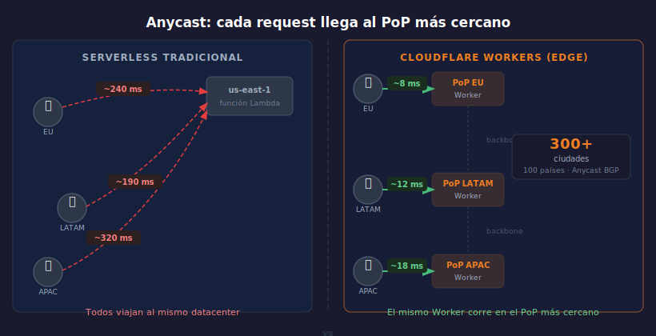

# La Red de Cloudflare

> 

## Objetivos

- Entender qué es Anycast y por qué reduce la latencia al mínimo
- Distinguir el modelo edge-first del serverless de región única
- Conocer qué pasa físicamente cuando un request llega a un PoP

---

## 1. La red en números

Cloudflare opera una red **Anycast** con más de 300 ciudades en 100 países.
Cada ciudad tiene uno o más **PoPs** (Points of Presence) — datacenters
propios donde se ejecuta el código de los Workers.

> Un Worker no vive en `us-east-1`. Vive en todos los PoPs a la vez.

Datos clave de la red Cloudflare (2025):

- Más de **300 ubicaciones** activas en todos los continentes
- Más de **330 Tbps** de capacidad de red total
- Interconexiones directas con **13.000+ redes** (ISPs, cloud providers, CDNs)
- El **95% de la población con acceso a internet** a menos de 50 ms de un PoP

Esta densidad es el motivo por el que Workers es fundamentalmente más rápido
que cualquier arquitectura basada en regiones.

---

## 2. Anycast: el mismo IP en todas partes

Con Anycast, la misma dirección IP es anunciada desde todos los PoPs vía BGP.
El router del ISP del usuario enruta el paquete al PoP más cercano
topológicamente — sin configuración ni geolocalización manual.

```
Usuario Madrid  →  PoP Madrid    (~8 ms)
Usuario Bogotá  →  PoP Bogotá    (~12 ms)
Usuario Tokio   →  PoP Tokio     (~9 ms)
```

**¿Por qué BGP?**
BGP (Border Gateway Protocol) es el protocolo de enrutamiento inter-AS de
internet. Cloudflare anuncia el mismo bloque de IPs desde cada PoP como
si fuera un nodo BGP independiente. Los routers de los ISPs prefieren
el camino con menos saltos — que casi siempre es el PoP más cercano.

Esto ocurre automáticamente, sin DNS geo-routing ni configuración adicional.

---

## 3. Edge-first vs serverless tradicional

| Aspecto | Lambda / Vercel (región única) | Cloudflare Workers |
|---------|-------------------------------|-------------------|
| Latencia típica | 80–300 ms | 5–30 ms |
| Cold start | 100–500 ms | < 5 ms (V8 Isolate) |
| Ubicación | Una región elegida | PoP más cercano |
| Modelo de aislamiento | Contenedor / MicroVM | V8 Isolate |
| Arranque del entorno | Segundos | Microsegundos |
| Escalado | Manual / automático por región | Global e instantáneo |

**Cold starts en Workers:**
En Lambda, cada nueva instancia de contenedor tarda cientos de milisegundos
en arrancar (importar módulos, inicializar runtime). En Workers, el Isolate
V8 compila el código una vez y lo reutiliza entre requests. El arranque real
de un Isolate nuevo es del orden de **microsegundos** — imperceptible.

---

## 4. V8 Isolates — el modelo de ejecución

Cada Worker corre en un **V8 Isolate** — no en un contenedor ni en una VM.
Un Isolate es una instancia del engine JavaScript de Chrome, completamente
aislada de otros Isolates en memoria y CPU.

Características clave:

- **Sin estado compartido** entre requests ni entre Workers distintos
- **Sin sistema de archivos** accesible (solo APIs Web)
- **Memoria limitada** por defecto a 128 MB por invocación
- **CPU limitada** — 10 ms en el plan gratuito, 30 s en el plan Paid
- El mismo Isolate puede **reutilizarse** para requests consecutivos
  al mismo Worker en el mismo PoP (mientras esté activo)

```
Request A ──► Isolate Worker-X  (ya existe → reutiliza)
Request B ──► Isolate Worker-X  (ya existe → reutiliza)
Request C ──► Isolate Worker-X  (ya existe → reutiliza)
Request D ──► Isolate Worker-X  (ya existe → reutiliza)
...
(Isolate frío sólo si lleva tiempo sin requests o en PoP nuevo)
```

---

## 5. ¿Qué pasa cuando llega un request?

1. Usuario hace `fetch("https://api.tuworker.workers.dev/items")`
2. DNS resuelve a la IP Anycast de Cloudflare
3. BGP enruta el TCP SYN al PoP más cercano
4. El PoP establece la conexión TLS y lee los headers HTTP
5. El sistema de Workers busca el Isolate del Worker en ese PoP
   - Si existe → reutiliza (sub-milisegundo)
   - Si no existe → compila y arranca (microsegundos)
6. El handler `fetch(req, env, ctx)` se ejecuta y devuelve la Response
7. La Response viaja de vuelta por la misma conexión TCP/TLS

Todo en un solo salto de red desde el usuario al código.
No hay routing adicional a otra región, no hay colas internas.

---

## 6. Smart Placement (opcional avanzado)

Por defecto, el Worker corre en el PoP más cercano al **usuario**.
Con **Smart Placement** activo, Cloudflare puede mover la ejecución al PoP
más cercano al **origen de datos** cuando detecta que el Worker hace
muchas llamadas a bases de datos remotas.

```jsonc
// wrangler.jsonc — activar Smart Placement
{
  "placement": { "mode": "smart" }
}
```

> Smart Placement es útil cuando el Worker hace múltiples subrequests a una
> base de datos en una región específica. Para Workers que solo leen de KV
> o D1 (que son globales), no aporta mejora.

---

## 7. Límites del plan gratuito vs Paid

Conocer los límites antes de deplegar evita sorpresas:

| Recurso | Plan Free | Plan Paid (Workers Paid) |
|---------|-----------|--------------------------|
| Requests/día | 100.000 | 10 millones incluidos |
| CPU por request | 10 ms | 30 segundos |
| Memoria por Isolate | 128 MB | 128 MB |
| Workers activos | 100 | ilimitados |
| `wrangler tail` | ✅ | ✅ |
| Cron triggers | ✅ 5 crons | ✅ ilimitados |
| Subrequests por invocación | 50 | 1000 |

> El límite de **10 ms de CPU** en Free es de tiempo de CPU puro —
> no incluye tiempo de espera en `await fetch()` ni `await kv.get()`.
> La mayoría de Workers de API simples consumen entre 0.5 y 3 ms de CPU.

---

## ✅ Checklist

- [ ] ¿Puedo explicar qué es Anycast sin mencionar "Cloudflare"?
- [ ] ¿Sé por qué un Worker en Madrid responde más rápido a un usuario europeo que una Lambda en us-east-1?
- [ ] ¿Entiendo por qué no existe cold start significativo en Workers?
- [ ] ¿Sé qué es un PoP y cuántos tiene Cloudflare?

---

## Referencias

- [How Cloudflare Works](https://developers.cloudflare.com/fundamentals/concepts/how-cloudflare-works/)
- [Cloudflare Network Map](https://www.cloudflare.com/network/)
- [Smart Placement](https://developers.cloudflare.com/workers/configuration/smart-placement/)
