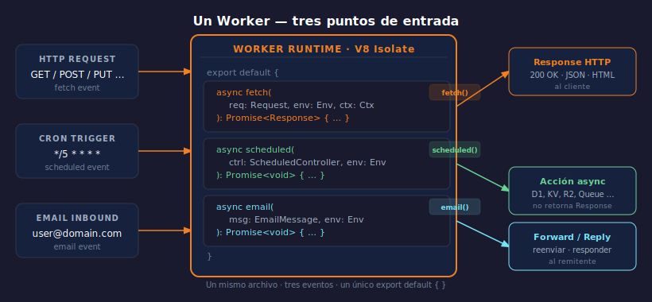

# Estructura de un Worker

> 

## Objetivos

- Escribir y entender la estructura mínima de un Worker
- Conocer los tres handlers disponibles: fetch, scheduled, email
- Configurar `wrangler.jsonc` con los campos obligatorios

---

## 1. El módulo Worker

Un Worker es un módulo ES que exporta un objeto con handlers.
No hay `require`, no hay `process`, no hay `__dirname` — solo Web APIs.

```typescript
// src/index.ts
export default {
  async fetch(req: Request, env: Env, ctx: ExecutionContext): Promise<Response> {
    return new Response("Hola edge", { status: 200 });
  },
};
```

`env` contiene los bindings (KV, D1, R2…). `ctx` expone `waitUntil()`.

---

## 2. Handler fetch — HTTP

Recibe toda request HTTP que llegue al Worker. Devuelve obligatoriamente
una `Response`. Si lanza sin catchear, Cloudflare devuelve 500.

```typescript
// Inspeccionamos método y ruta para enrutar
async fetch(req: Request, env: Env) {
  const url = new URL(req.url);
  if (url.pathname === "/health") return new Response("ok");
  return new Response("Not found", { status: 404 });
},
```

---

## 3. Handler scheduled — Cron

Se dispara por un trigger de cron definido en `wrangler.jsonc`.
No recibe request ni devuelve Response.

```typescript
async scheduled(ctrl: ScheduledController, env: Env) {
  // ctrl.scheduledTime: timestamp del disparo
  // ctrl.cron: expresión cron que lo activó
  console.log("Cron ejecutado:", ctrl.cron);
},
```

---

## 4. Handler email — Email Worker

Recibe emails entrantes a una dirección asociada al Worker.

```typescript
async email(msg: EmailMessage, env: Env) {
  // Reenviar a otra dirección
  await msg.forward("admin@example.com");
},
```

---

## 5. wrangler.jsonc mínimo

```jsonc
{
  "name": "mi-primer-worker",
  "main": "src/index.ts",
  "compatibility_date": "2024-09-23",
  "compatibility_flags": ["nodejs_compat_v2"]
}
```

`compatibility_date` controla qué cambios de runtime están activos.
Usar siempre una fecha pasada real — nunca `"latest"`.

---

## ✅ Checklist

- [ ] ¿Sé qué devuelve obligatoriamente el handler `fetch`?
- [ ] ¿Puedo crear un Worker que responda diferente según el path de la URL?
- [ ] ¿Entiendo para qué sirve `ctx.waitUntil()`?
- [ ] ¿Sé qué hace `compatibility_date` en `wrangler.jsonc`?

## Referencias

- [Workers Runtime API](https://developers.cloudflare.com/workers/runtime-apis/)
- [Scheduled Workers](https://developers.cloudflare.com/workers/configuration/cron-triggers/)
