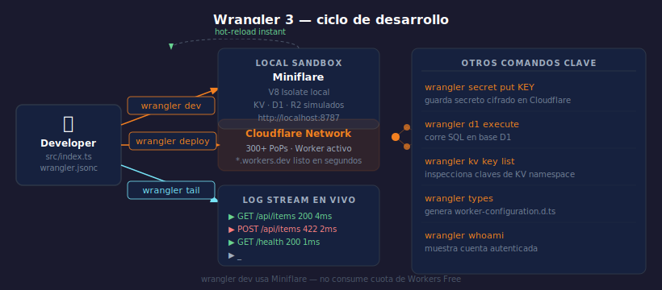

# Wrangler 3 — CLI de Cloudflare Workers

> 

## Objetivos

- Instalar Wrangler y autenticarse con una cuenta Cloudflare
- Usar `wrangler dev` para el ciclo de desarrollo local
- Desplegar y observar un Worker en producción

---

## 1. Instalación y autenticación

```bash
# Instalar de forma global con versión exacta
pnpm add -g wrangler@4.90.1

# Autenticarse (abre el navegador)
wrangler login

# Verificar que funciona
wrangler whoami
```

> `.dev.vars` almacena variables de entorno locales para `wrangler dev`.
> Nunca hacer commit de este archivo — ya está en `.gitignore`.

---

## 2. wrangler dev — desarrollo local

```bash
# Arranca Miniflare en http://localhost:8787
wrangler dev

# Con hot-reload y acceso a recursos reales de Cloudflare
wrangler dev --remote
```

`wrangler dev` (sin `--remote`) corre Miniflare localmente — no consume
cuota del plan, no necesita internet y recarga al guardar.

---

## 3. wrangler deploy — despliegue

```bash
# Despliega a producción en Workers.dev
wrangler deploy

# Despliega a un entorno específico
wrangler deploy --env staging
```

El Worker queda activo en `https://<nombre>.<subdominio>.workers.dev`
en cuestión de segundos. Los 300+ PoPs reciben el código al instante.

---

## 4. wrangler tail — logs en tiempo real

```bash
# Logs de producción en tiempo real
wrangler tail

# Filtrar por status o método
wrangler tail --status error
wrangler tail --method POST
```

Cada request muestra: método, path, status code, duración y logs
de `console.log()` del Worker.

---

## 5. Gestión de secretos

```bash
# Guardar un secreto cifrado (no se ve en wrangler.jsonc)
wrangler secret put API_KEY

# Listar secretos configurados
wrangler secret list

# Eliminar un secreto
wrangler secret delete API_KEY
```

Los secretos se acceden en el Worker vía `env.API_KEY` igual que
cualquier variable de entorno — pero nunca aparecen en texto plano.

---

## ✅ Checklist

- [ ] ¿Puedo correr `wrangler dev` y ver mi Worker en localhost:8787?
- [ ] ¿Sé la diferencia entre `wrangler dev` y `wrangler dev --remote`?
- [ ] ¿Puedo guardar un secreto con `wrangler secret put` y leerlo en el Worker?
- [ ] ¿Sé filtrar logs de producción con `wrangler tail --status error`?

## Referencias

- [Wrangler CLI Reference](https://developers.cloudflare.com/workers/wrangler/commands/)
- [Get Started with Workers](https://developers.cloudflare.com/workers/get-started/guide/)
