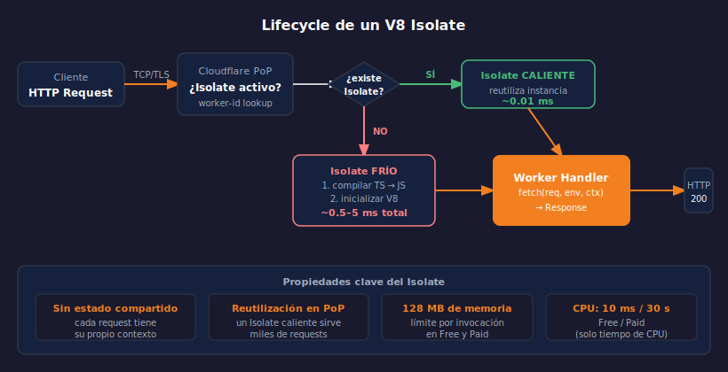

# V8 Isolates — El motor de Workers

> 

## Objetivos

- Entender qué es un V8 Isolate y cómo difiere de un contenedor
- Conocer el lifecycle completo: frío, caliente y retire
- Comprender por qué Workers no tiene cold start perceptible

---

## 1. V8: el engine JavaScript de Chrome

V8 es el motor JavaScript de código abierto de Google, el mismo que usa
Chrome y Node.js. Cloudflare lo usa directamente — sin Node.js encima.

Esto significa que Workers **no** es una función Lambda ni un contenedor.
No hay sistema operativo, no hay proceso Node.js, no hay filesystem.
Solo JavaScript ejecutado directamente sobre V8.

Comparación con otros modelos de ejecución:

| Modelo | Arranque | Aislamiento | Overhead de memoria |
|--------|----------|-------------|---------------------|
| Contenedor (Docker) | 500 ms – 2 s | Namespace/cgroup | ~50–200 MB |
| MicroVM (Firecracker) | 100–300 ms | VMM | ~5–50 MB |
| V8 Isolate | < 5 ms | Engine JS | ~1–5 MB |

---

## 2. ¿Qué es un Isolate?

Un **Isolate** es una instancia aislada del engine V8. Tiene su propio:

- Heap de memoria JavaScript (no compartido con otros Isolates)
- Contexto de ejecución (variables globales, prototypes)
- Estado de compilación JIT del código del Worker

Dentro de un Isolate pueden existir múltiples **Contexts** —
Cloudflare usa uno por Worker para aislarlos entre sí.

```
PoP Madrid
├── Isolate: Worker-A  (heap propio, 3.2 MB)
│   └── Context: tenant-1
├── Isolate: Worker-B  (heap propio, 2.8 MB)
│   └── Context: tenant-1
└── Isolate: Worker-A  (heap propio, 3.1 MB)  ← otra instancia
    └── Context: tenant-2
```

Dos requests al mismo Worker **no comparten** el mismo Isolate a menos
que el PoP reutilice uno que ya estaba activo.

---

## 3. Lifecycle: frío, caliente y retire

**Frío (Cold Start):**
Cuando no existe ningún Isolate del Worker en ese PoP. El sistema:
1. Descarga el bundle del Worker (< 1 MB comprimido)
2. Inicializa el engine V8
3. Compila y ejecuta el código al nivel de módulo (top-level)
4. El Isolate queda listo — esto tarda entre 0.5 y 5 ms total

**Caliente (Warm):**
El Isolate ya existe en el PoP (fue creado para una request anterior).
El handler `fetch` se invoca directamente: **< 0.01 ms de overhead**.
El 95%+ de las requests en producción llegan a un Isolate caliente.

**Retire:**
El PoP decide destruir el Isolate cuando:
- No ha recibido requests en los últimos ~30 segundos
- El PoP necesita liberar memoria
- Se deployó una nueva versión del Worker

---

## 4. Global scope vs request scope

Una consecuencia importante del lifecycle: el **código a nivel de módulo**
(top-level) solo se ejecuta una vez por Isolate, no por request.

```typescript
// ✅ Top-level: se ejecuta UNA vez cuando el Isolate arranca
const CACHED_CONFIG = { version: "1.0", region: "EU" };
const compiledRegex = /^\/api\/v\d+\//;

export default {
  async fetch(req: Request) {
    // ✅ Se ejecuta en CADA request — estado fresco por invocación
    const url = new URL(req.url);

    // CACHED_CONFIG está disponible — se creó al inicio del Isolate
    return Response.json({ config: CACHED_CONFIG, path: url.pathname });
  },
};
```

> Usar el top-level para constantes y compilaciones costosas.
> Nunca guardar estado mutable en el top-level — puede filtrarse entre requests.

---

## 5. Sin estado persistente entre requests

Los Isolates son **stateless por diseño** para requests independientes.
Si necesitas estado persistente entre requests, debes usar un binding:

| Necesidad | Solución |
|-----------|----------|
| Contar visitas | Workers KV (semana 4) |
| Sesiones de usuario | Workers KV o D1 (semana 5) |
| Estado en tiempo real | Durable Objects (semana 8) |
| Estado compartido en PoP | Durable Objects (semana 8) |

Intentar usar una variable mutable en top-level como "cache compartida"
entre requests puede funcionar en dev pero falla en producción donde
existen múltiples Isolates por PoP.

---

## 6. Por qué V8 Isolates son seguros para multi-tenant

Cloudflare ejecuta Workers de miles de clientes en el mismo hardware.
El modelo Isolate garantiza el aislamiento porque:

- **Memoria**: cada Isolate tiene su propio heap — un Worker no puede
  leer la memoria de otro, ni siquiera con exploits de tipo buffer overflow
- **CPU**: el scheduler de V8 asigna tiempo de CPU por Isolate
- **I/O**: las APIs de red están mediadas por el runtime — un Worker
  no puede hacer socket raw ni acceder a la red del host

Este nivel de aislamiento es comparable al de una VM pero con microsegundos
de latencia de arranque en lugar de cientos de milisegundos.

---

## ✅ Checklist

- [ ] ¿Puedo explicar qué diferencia hay entre un Isolate y un contenedor Docker?
- [ ] ¿Sé qué código se ejecuta en top-level y qué en cada request?
- [ ] ¿Entiendo por qué guardar estado mutable en top-level es peligroso?
- [ ] ¿Sé qué herramienta usar cuando necesito estado persistente entre requests?

---

## Referencias

- [How Workers works](https://developers.cloudflare.com/workers/reference/how-workers-works/)
- [V8 Isolates](https://v8.dev/blog/sandbox)
- [Workers Limits](https://developers.cloudflare.com/workers/platform/limits/)
