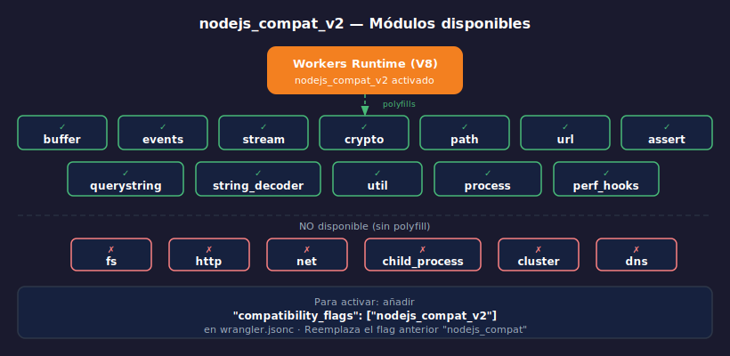

# nodejs_compat_v2 — Módulos Node.js en Workers

> 

## Objetivos

- Activar `nodejs_compat_v2` y entender qué módulos habilita
- Importar `crypto`, `buffer` y `events` desde el runtime de Workers
- Distinguir cuándo usar las Web APIs nativas vs el polyfill de Node.js

---

## 1. El problema sin el flag

Workers corre V8 puro. Sin ningún flag de compatibilidad, los imports
de módulos Node.js fallan en tiempo de deploy:

```typescript
// ❌ Sin nodejs_compat_v2 — error en wrangler deploy
import { createHash } from "crypto";
import { Buffer } from "buffer";
import { EventEmitter } from "events";
// Error: "No such module 'crypto'" (o similar)
```

Muchos paquetes npm dependen internamente de estos módulos, por eso
instalar una librería popular puede requerir el flag activo.

---

## 2. Activar nodejs_compat_v2

```jsonc
// wrangler.jsonc
{
  "name": "mi-worker",
  "main": "src/index.ts",
  "compatibility_date": "2024-09-23",
  "compatibility_flags": ["nodejs_compat_v2"]
}
```

> `nodejs_compat_v2` reemplaza al flag anterior `nodejs_compat`.
> No es necesario incluir ambos — usar solo `nodejs_compat_v2`.

---

## 3. Módulos disponibles tras activar el flag

```typescript
// ✅ Todos disponibles con nodejs_compat_v2
import { createHash, createHmac, randomBytes } from "crypto";
import { Buffer } from "buffer";
import { EventEmitter } from "events";
import { Readable, Transform } from "stream";
import path from "path";
import { parseQS } from "querystring";
import { StringDecoder } from "string_decoder";
import { promisify, inspect } from "util";
import assert from "assert";
import { URL as NodeURL } from "url";
import { performance } from "perf_hooks";
```

---

## 4. Uso práctico: crypto de Node.js

Aunque `crypto.subtle` (Web API) es la opción preferida para nuevos proyectos,
`nodejs:crypto` ofrece una API más familiar para código Node.js existente:

```typescript
import { createHash, createHmac, randomBytes } from "crypto";

// Hash SHA-256 con API de Node.js
function hashMd5(text: string): string {
  return createHash("sha256").update(text).digest("hex");
}

// HMAC-SHA256 con API de Node.js (más legible que SubtleCrypto)
function signWebhook(payload: string, secret: string): string {
  return createHmac("sha256", secret).update(payload).digest("hex");
}

// Bytes aleatorios para tokens seguros
function generateToken(bytes = 32): string {
  return randomBytes(bytes).toString("hex");
}
```

---

## 5. Uso práctico: Buffer

`Buffer` es útil para manipular datos binarios, base64 y encoding:

```typescript
import { Buffer } from "buffer";

async function decodeBasicAuth(authHeader: string): Promise<{ user: string; pass: string } | null> {
  if (!authHeader.startsWith("Basic ")) return null;

  const encoded = authHeader.slice(6);
  const decoded = Buffer.from(encoded, "base64").toString("utf8");
  const [user, pass] = decoded.split(":");

  return { user, pass };
}

// Base64 encode para respuestas (e.g., imágenes pequeñas)
function toBase64(text: string): string {
  return Buffer.from(text, "utf8").toString("base64");
}
```

---

## 6. Web API vs Node.js: ¿cuándo usar cada uno?

| Tarea | Web API (recomendado) | Node.js (nodejs_compat_v2) |
|-------|----------------------|---------------------------|
| Hash SHA-256 | `crypto.subtle.digest()` | `createHash("sha256")` |
| HMAC | `crypto.subtle.sign()` | `createHmac("sha256", key)` |
| UUID | `crypto.randomUUID()` | `randomUUID()` (también disponible) |
| Base64 | `btoa()` / `atob()` | `Buffer.from().toString("base64")` |
| Streams | `ReadableStream` / `TransformStream` | `Readable` / `Transform` |

> Prefiere Web APIs para código nuevo — son estándar y no requieren el flag.
> Usa Node.js polyfills cuando portes código existente de Node.js o cuando
> una librería npm que necesitas depende de módulos Node.js internamente.

---

## 7. Librerías npm que requieren nodejs_compat_v2

Muchas librerías populares de npm dependen de módulos Node.js:

```typescript
// Estas librerías requieren nodejs_compat_v2 activo:
import bcrypt from "bcryptjs";       // usa crypto internamente
import { parse } from "csv-parse";   // usa stream y buffer
import sharp from "sharp";            // procesamiento de imágenes
import nodemailer from "nodemailer";  // usa net y eventos

// Sin el flag → error al deploy:
// "Could not resolve 'crypto'" o "Could not resolve 'stream'"
```

Si una librería falla con un error de módulo no encontrado, lo primero
es verificar si `nodejs_compat_v2` ya está activo en `wrangler.jsonc`.

---

## ✅ Checklist

- [ ] ¿Sé dónde activar `nodejs_compat_v2` en `wrangler.jsonc`?
- [ ] ¿Puedo hacer un hash SHA-256 con la API de Node.js (`createHash`)?
- [ ] ¿Entiendo cuándo usar Web APIs nativas vs el polyfill de Node.js?
- [ ] ¿Sé diagnosticar un error de módulo no encontrado y cómo resolverlo?

---

## Referencias

- [nodejs_compat_v2](https://developers.cloudflare.com/workers/configuration/compatibility-dates/#nodejs-compatibility-flag)
- [Node.js compatibility](https://developers.cloudflare.com/workers/runtime-apis/nodejs/)
- [Compatibility flags](https://developers.cloudflare.com/workers/configuration/compatibility-flags/)
