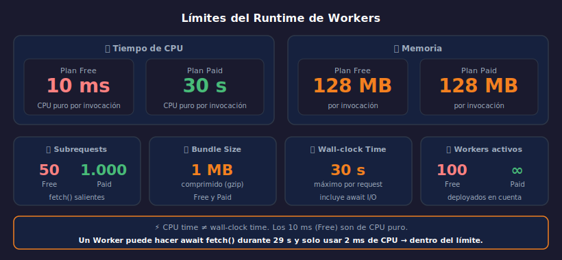

# Límites del Runtime de Workers

> 

## Objetivos

- Conocer los límites de CPU, memoria, bundle y subrequests
- Entender la diferencia entre CPU time y wall-clock time
- Escribir Workers que operen dentro de los límites del plan Free

---

## 1. CPU time vs wall-clock time

Este es el concepto más importante — y el más malentendido:

**CPU time**: tiempo que el motor V8 ejecuta activamente tu código JavaScript.
No incluye el tiempo esperando en `await`.

**Wall-clock time**: tiempo total desde que llega la request hasta que se devuelve
la Response, incluyendo todo el tiempo de espera en llamadas a I/O.

```
Request llega:          t=0
await fetch(api):       t=1ms   CPU=1ms  ← tu código calcula la URL
...esperando respuesta: t=250ms CPU=1ms  ← CPU no suma, estás en await
Response de API llega:  t=251ms CPU=1ms
await kv.get(key):      t=252ms CPU=1ms  ← tu código procesa el resultado
...esperando KV:        t=270ms CPU=1ms  ← CPU no suma
Devuelves Response:     t=271ms CPU=2ms  ← procesamiento final

Wall-clock: 271ms  /  CPU: ~3ms  → dentro del límite Free (10ms CPU)
```

Un Worker puede hacer muchos `await` sin problema — el contador de CPU
solo corre cuando V8 está ejecutando código, no cuando espera I/O.

---

## 2. Límite de CPU: 10 ms (Free) vs 30 s (Paid)

El límite de CPU es la restricción más importante del plan Free.
10 ms de CPU parece poco — pero en la práctica alcanza para:

```typescript
// Esto consume ~0.5-2 ms de CPU total:
async fetch(req: Request, env: Env) {
  const url = new URL(req.url);           // ~0.01 ms
  const data = await env.KV.get("items"); // ~0 ms CPU (es await)
  const items = JSON.parse(data ?? "[]"); // ~0.1-0.5 ms según tamaño
  return Response.json(items);            // ~0.1 ms
}
```

Lo que **sí** consume CPU rápidamente:

```typescript
// ⚠️ Cuidado — bucles intensivos consumen CPU real
const result = largeArray.map(item => heavyTransformation(item)); // potencialmente > 10ms
await crypto.subtle.digest("SHA-256", largeBuffer);               // hash de datos grandes
JSON.parse(veryLargeJson);                                         // parsing > 100KB
```

---

## 3. Límite de memoria: 128 MB

Cada Isolate tiene 128 MB de heap disponible, sin diferencia entre Free y Paid.
Este límite aplica a:

- Variables JavaScript en memoria
- Buffers de datos (imágenes, archivos)
- Módulos importados y sus dependencias
- El bundle del Worker mismo

Buenas prácticas para mantenerse dentro del límite:

```typescript
// ✅ Procesar datos en streaming en vez de cargarlos completos en memoria
async fetch(req: Request) {
  const { readable, writable } = new TransformStream();
  // Transformar chunk por chunk → no carga todo en memoria
  return new Response(readable);
}

// ❌ Cargar archivos grandes completos en memoria
const bigFile = await env.BUCKET.get("video.mp4");
const buffer = await bigFile.arrayBuffer(); // podría ser > 128 MB
```

---

## 4. Bundle size: < 1 MB comprimido

El código del Worker (JS compilado + dependencias npm) debe pesar menos
de 1 MB comprimido con gzip (≈ 3-4 MB sin comprimir).

`wrangler deploy` falla automáticamente si el bundle excede el límite.

Para manejar el tamaño:

```bash
# Ver el tamaño del bundle antes de deployar
wrangler deploy --dry-run --outdir=dist
ls -lh dist/

# Analizar qué ocupa espacio
npx bundle-size dist/worker.js
```

Estrategias para reducir tamaño:
- Importar solo las funciones que necesitas (tree-shaking)
- Preferir librerías ligeras diseñadas para edge
- Evitar dependencias con muchos sub-módulos de Node.js

```typescript
// ✅ Import específico — solo importa lo que necesitas
import { Hono } from "hono";
import { zValidator } from "@hono/zod-validator";

// ❌ Import de todo un namespace grande innecesariamente
import * as everything from "some-large-library";
```

---

## 5. Subrequests: 50 (Free) vs 1.000 (Paid)

Cada llamada a `fetch()` saliente desde el Worker cuenta como subrequest.
Esto incluye llamadas a APIs externas, pero **no** incluye:
- Accesos a KV, D1, R2, Queues (son bindings, no subrequests)
- La request entrante del usuario

```typescript
// ✅ Paralelizar para usar menos "tiempo" de subrequests
async fetch(req: Request, env: Env) {
  // Dos subrequests en paralelo — más eficiente
  const [weatherData, newsData] = await Promise.all([
    fetch("https://api.weather.com/current"),
    fetch("https://api.news.com/top"),
  ]);

  // ❌ En serie — same number of subrequests but wastes wall-clock time
  // const weather = await fetch("https://api.weather.com/current");
  // const news = await fetch("https://api.news.com/top");
}
```

---

## 6. Workers activos: 100 (Free) vs ilimitado (Paid)

El plan Free permite hasta 100 Workers deployados simultáneamente en la cuenta.
Esto no afecta el rendimiento — es solo un límite de cantidad de Workers distintos.

Para el bootcamp, con el plan Free tienes más que suficiente espacio para
todos los ejercicios y proyectos de las 21 semanas.

---

## 7. Cómo monitorizar el uso de CPU en producción

```bash
# wrangler tail muestra el CPU time de cada request
wrangler tail --format pretty

# Salida de ejemplo:
# GET /api/items - 200 [cpu: 2.3ms, wall: 45ms]
# POST /api/items - 201 [cpu: 3.1ms, wall: 89ms]
```

Si ves requests acercándose a 8-9 ms de CPU en Free, considera:
- Hacer el Plan Paid
- Mover lógica pesada a un Worker separado
- Cachear resultados con KV

---

## ✅ Checklist

- [ ] ¿Puedo explicar la diferencia entre CPU time y wall-clock time?
- [ ] ¿Sé qué tipo de operaciones consumen CPU rápidamente en Workers?
- [ ] ¿Entiendo qué cuenta como subrequest y qué no?
- [ ] ¿Sé cómo ver el CPU time de mis Workers con `wrangler tail`?

---

## Referencias

- [Workers Limits](https://developers.cloudflare.com/workers/platform/limits/)
- [Workers Pricing](https://developers.cloudflare.com/workers/platform/pricing/)
- [Bundle Size Limits](https://developers.cloudflare.com/workers/platform/limits/#worker-size)
