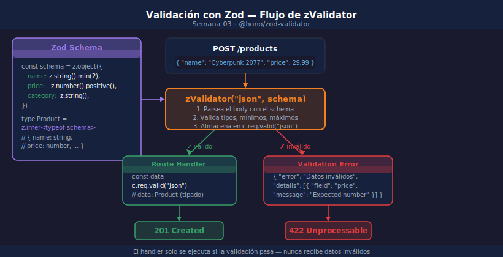

# Validación con Zod y @hono/zod-validator

## Objetivos

- Definir schemas Zod para validar `body`, `params` y `query` en un solo paso
- Usar `c.req.valid()` para obtener datos ya validados con tipos TypeScript correctos
- Personalizar los errores de validación devueltos al cliente
- Reutilizar schemas entre routes y entre starter/solution

> 

---

## 1. El Problema Sin Validación

Sin validar el body, cualquier payload malformado puede romper el Worker:

```typescript
// ❌ Sin validación — JSON.parse puede fallar o llegar con campos faltantes
app.post("/products", async (c) => {
  const body = await c.req.json(); // any — sin tipos
  // body.name puede ser undefined, number, o un objeto
  return c.json({ name: body.name.toUpperCase() }, 201); // ← falla si name es undefined
});
```

---

## 2. zValidator — Validación en el Middleware

`@hono/zod-validator` añade un middleware que:
1. Parsea el input con el schema Zod
2. Si falla → responde 422 automáticamente (no llega al handler)
3. Si pasa → disponible en `c.req.valid(target)` con tipos correctos

```typescript
import { Hono }       from "hono";
import { zValidator } from "@hono/zod-validator";
import { z }          from "zod";

const productSchema = z.object({
  name:        z.string().min(2).max(100),
  price:       z.number().positive(),
  category:    z.string(),
  description: z.string().optional(),
});

app.post(
  "/products",
  zValidator("json", productSchema),  // ← middleware de validación
  (c) => {
    const { name, price, category } = c.req.valid("json"); // tipos inferidos
    return c.json({ name, price, category }, 201);
  }
);
```

---

## 3. Validar Params y Query

`zValidator` acepta cualquier target: `"json"`, `"param"`, `"query"`, `"header"`:

```typescript
// Validar path params: GET /products/:id
const paramSchema = z.object({
  id: z.string().regex(/^\d+$/, "El id debe ser numérico"),
});

app.get(
  "/products/:id",
  zValidator("param", paramSchema),
  (c) => {
    const { id } = c.req.valid("param"); // string validado
    const product = PRODUCTS.find((p) => p.id === Number(id));
    if (!product) return c.json({ error: "No encontrado" }, 404);
    return c.json(product);
  }
);

// Validar query params: GET /products?limit=10&page=2
const querySchema = z.object({
  limit:    z.coerce.number().int().min(1).max(100).default(20),
  page:     z.coerce.number().int().min(1).default(1),
  category: z.string().optional(),
});

app.get(
  "/products",
  zValidator("query", querySchema),
  (c) => {
    const { limit, page, category } = c.req.valid("query"); // number, no string
    return c.json({ limit, page, category });
  }
);
```

> `z.coerce.number()` convierte el string `"10"` a `number 10` — útil para query params.

---

## 4. Tipos Inferidos con z.infer

No necesitas definir una interface por separado — Zod la genera:

```typescript
const productSchema = z.object({
  name:  z.string().min(2),
  price: z.number().positive(),
});

// TypeScript infiere el tipo automáticamente
type Product = z.infer<typeof productSchema>;
// → { name: string; price: number }

// Reutiliza el tipo en funciones auxiliares
function formatProduct(p: Product): string {
  return `${p.name} — $${p.price.toFixed(2)}`;
}
```

---

## 5. Errores de Validación Personalizados

Por defecto `zValidator` devuelve 400. Para devolver 422 con un mensaje detallado,
usa el callback de error:

```typescript
app.post(
  "/products",
  zValidator("json", productSchema, (result, c) => {
    if (!result.success) {
      const errors = result.error.issues.map((i) => ({
        field: i.path.join("."),
        message: i.message,
      }));
      return c.json({ error: "Datos inválidos", details: errors }, 422);
    }
  }),
  (c) => {
    const data = c.req.valid("json");
    return c.json(data, 201);
  }
);
```

Respuesta de ejemplo:
```json
{
  "error": "Datos inválidos",
  "details": [
    { "field": "price", "message": "Number must be greater than 0" },
    { "field": "name",  "message": "String must contain at least 2 character(s)" }
  ]
}
```

---

## 6. Schemas Reutilizables

Define schemas en un archivo separado para reutilizarlos en routes, tests y docs:

```typescript
// src/schemas/product.ts
import { z } from "zod";

export const createProductSchema = z.object({
  name:     z.string().min(2).max(100),
  price:    z.number().positive(),
  category: z.enum(["rpg", "fps", "strategy", "sports"]),
});

export const updateProductSchema = createProductSchema.partial();
// partial() hace todos los campos opcionales — útil para PATCH

export type CreateProduct = z.infer<typeof createProductSchema>;
export type UpdateProduct = z.infer<typeof updateProductSchema>;
```

---

## ✅ Checklist

- [ ] ¿Uso `zValidator("json", schema)` en todos los endpoints POST, PUT y PATCH?
- [ ] ¿Uso `z.coerce.number()` para query params que deben ser números?
- [ ] ¿Obtengo los datos con `c.req.valid(target)` en lugar de `c.req.json()`?
- [ ] ¿Mis schemas están en un archivo separado para poder reutilizarlos?

---

## Referencias

- [Zod Documentation](https://zod.dev/)
- [@hono/zod-validator](https://hono.dev/docs/guides/validation#zod-validator)
- [Zod — coerce](https://zod.dev/?id=coercion-for-primitives)
