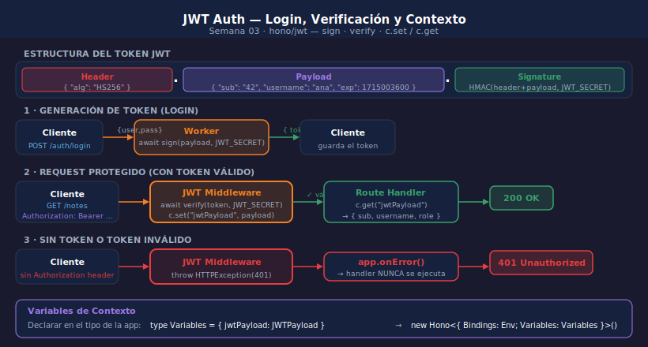

# JWT y Autenticación con Hono

## Objetivos

- Entender la estructura de un JWT y qué información transporta
- Generar tokens con `sign()` y verificarlos con `verify()` de `hono/jwt`
- Proteger rutas con el middleware `jwt()` y acceder al payload desde el handler
- Usar Variables de contexto (`c.set` / `c.get`) para pasar datos entre middlewares

> 

---

## 1. Qué es un JWT

Un JSON Web Token es una cadena con 3 partes separadas por puntos:

```
eyJhbGciOiJIUzI1NiJ9   ←  Header  (algoritmo: HS256)
.eyJzdWIiOiI0MiJ9       ←  Payload (datos: sub, exp, username…)
.SflKxwRJSMeKKF2QT4fwp  ←  Signature (HMAC del header+payload con el secret)
```

El servidor no almacena el token. Solo guarda el `secret` para verificar la firma.
Si el secret es distinto o el payload fue alterado, la verificación falla.

```typescript
// Payload típico de un JWT de autenticación
{
  "sub":      "42",             // subject — id del usuario
  "username": "ana_garcia",
  "role":     "admin",
  "iat":      1715000000,       // issued at
  "exp":      1715003600        // expiration (+1h)
}
```

---

## 2. Generar Tokens con sign()

`hono/jwt` usa Web Crypto API internamente — no requiere `nodejs_compat_v2`:

```typescript
import { sign } from "hono/jwt";

// POST /auth/login
app.post("/auth/login", async (c) => {
  const { username, password } = await c.req.json();

  // Verificar credenciales (aquí con array hardcoded — en S05 usaremos D1)
  const user = USERS.find((u) => u.username === username && u.password === password);
  if (!user) {
    return c.json({ error: "Credenciales incorrectas" }, 401);
  }

  const now = Math.floor(Date.now() / 1000);
  const token = await sign(
    {
      sub:      String(user.id),
      username: user.username,
      role:     user.role,
      iat:      now,
      exp:      now + 3600, // 1 hora
    },
    c.env.JWT_SECRET
  );

  return c.json({ token });
});
```

---

## 3. Middleware de Verificación

El middleware verifica la firma del token antes de que llegue al handler:

```typescript
import { verify } from "hono/jwt";
import { HTTPException } from "hono/http-exception";

// Middleware personalizado: extrae y verifica el token
app.use("/protected/*", async (c, next) => {
  const authHeader = c.req.header("Authorization");

  if (!authHeader?.startsWith("Bearer ")) {
    throw new HTTPException(401, { message: "Token de autenticación requerido" });
  }

  const token = authHeader.slice(7); // elimina "Bearer "

  try {
    const payload = await verify(token, c.env.JWT_SECRET);
    c.set("jwtPayload", payload); // disponible en todos los handlers posteriores
    await next();
  } catch {
    throw new HTTPException(401, { message: "Token inválido o expirado" });
  }
});
```

---

## 4. Variables de Contexto — c.set / c.get

Las Variables de contexto permiten pasar datos del middleware al handler de ruta.
Deben declararse en el tipo de la app para que TypeScript las conozca:

```typescript
// Tipo del payload JWT
type JWTPayload = {
  sub:      string;
  username: string;
  role:     string;
  exp:      number;
};

// Variables disponibles en el contexto de cada request
type Variables = {
  jwtPayload: JWTPayload;
};

// Hono tipado con Bindings y Variables
const app = new Hono<{ Bindings: Env; Variables: Variables }>();

// En el middleware:
c.set("jwtPayload", payload);

// En el handler:
const { sub, username } = c.get("jwtPayload");
```

---

## 5. Rutas Protegidas vs Públicas

Combina `app.use()` con `app.route()` para separar rutas públicas de protegidas:

```typescript
const app = new Hono<{ Bindings: Env; Variables: Variables }>();

// Rutas públicas — sin middleware de auth
app.post("/auth/login",    loginHandler);
app.post("/auth/register", registerHandler);
app.get("/health",         healthHandler);

// Middleware de auth solo para /notes/*
app.use("/notes/*", jwtMiddleware);

// Rutas protegidas — requieren token válido
app.get("/notes",      listNotesHandler);
app.post("/notes",     createNoteHandler);
app.delete("/notes/:id", deleteNoteHandler);
```

---

## 6. Expiración y Errores Comunes

| Error                    | Causa                                           | Solución                         |
|--------------------------|-------------------------------------------------|----------------------------------|
| 401 "Token requerido"    | No se envió `Authorization: Bearer <token>`     | Incluir el header en el request  |
| 401 "Token expirado"     | El `exp` del payload ya pasó                    | Solicitar nuevo token con login  |
| 401 "Token inválido"     | Secret incorrecto o payload alterado            | Verificar secret en wrangler     |
| 500 en sign()            | JWT_SECRET vacío o no configurado en `vars`     | Añadir a `wrangler.jsonc` vars   |

Para renovar tokens, implementa un endpoint `POST /auth/refresh` que acepte
el token actual y devuelva uno nuevo con `exp` extendido.

---

## ✅ Checklist

- [ ] ¿Mi JWT_SECRET está en `wrangler.jsonc` como var (en dev) y como secret en producción?
- [ ] ¿Declaro el tipo `Variables` en la app Hono para que `c.get("jwtPayload")` esté tipado?
- [ ] ¿El middleware de auth está declarado con `app.use("/protected/*", ...)` antes de las rutas?
- [ ] ¿El endpoint de login devuelve 401 (no 403) cuando las credenciales son incorrectas?

---

## Referencias

- [hono/jwt](https://hono.dev/docs/middleware/builtin/jwt)
- [RFC 7519 — JSON Web Token (JWT)](https://datatracker.ietf.org/doc/html/rfc7519)
- [jwt.io — Debugger interactivo](https://jwt.io/)
