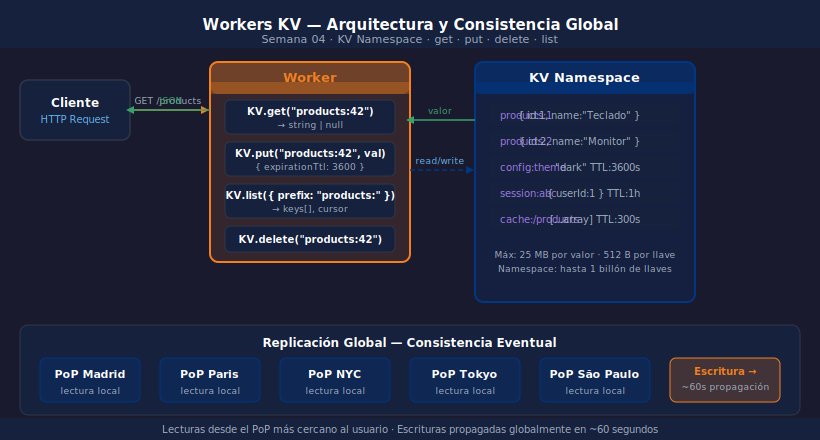

# Workers KV — Fundamentos

> 

## Objetivos

- Entender qué es Workers KV y cuándo usarlo
- Crear, leer y eliminar entradas con el binding KV
- Diseñar llaves con prefijos para organizar los datos
- Configurar el binding en `wrangler.jsonc`

---

## 1. ¿Qué es Workers KV?

Workers KV es un **almacén clave-valor** distribuido globalmente.
Los datos se replican a todos los PoPs de Cloudflare (200+) — las lecturas
son locales y ultrarrápidas. Las escrituras son **eventual consistent**:
tarda ≈60 segundos en propagarse a todos los PoPs.

> Úsalo para datos que se leen frecuentemente pero se escriben poco: catálogos, configuración, sesiones, respuestas cacheadas.

---

## 2. Binding en wrangler.jsonc

```jsonc
{
  "kv_namespaces": [
    {
      "binding": "PRODUCTS_KV",
      "id": "REPLACE_WITH_YOUR_KV_ID"
      // "preview_id" es opcional — wrangler dev usa un KV local automático
    }
  ]
}
```

El `binding` es el nombre con el que accedes a KV en el código:

```typescript
type Bindings = { PRODUCTS_KV: KVNamespace };
const app = new Hono<{ Bindings: Bindings }>();

app.get("/test", async (c) => {
  await c.env.PRODUCTS_KV.put("hello", "world");
  const val = await c.env.PRODUCTS_KV.get("hello");
  return c.json({ val }); // { "val": "world" }
});
```

---

## 3. Operaciones CRUD

```typescript
// Crear / actualizar
await c.env.KV.put("products:42", JSON.stringify({ id: 42, name: "Teclado" }));

// Leer — devuelve string | null
const raw = await c.env.KV.get("products:42");
const product = raw ? JSON.parse(raw) : null;

// Leer como JSON directamente
const product = await c.env.KV.get("products:42", { type: "json" });

// Eliminar
await c.env.KV.delete("products:42");
```

---

## 4. Listar llaves con prefijo

`KV.list()` devuelve llaves que coinciden con el prefijo:

```typescript
// Lista hasta 1000 llaves con prefijo "products:"
const result = await c.env.KV.list({ prefix: "products:", limit: 100 });

// result.keys = [{ name: "products:1" }, { name: "products:2" }, ...]
// result.list_complete = false si hay más páginas
// result.cursor = cursor para la siguiente página

const ids = result.keys.map((k) => k.name.replace("products:", ""));
```

> `KV.list()` devuelve solo llaves, no valores. Para leer los valores haz un `KV.get()` por cada llave.

---

## 5. Tipos de valor soportados

| Tipo | Ejemplo |
|------|---------|
| `string` (default) | `KV.put("k", "texto")` |
| `json` (auto-parse) | `KV.get("k", { type: "json" })` |
| `arrayBuffer` | `KV.get("k", { type: "arrayBuffer" })` |
| `stream` | `KV.get("k", { type: "stream" })` |

---

## ✅ Checklist

- [ ] ¿Creaste el namespace con `wrangler kv namespace create` y copiaste el id?
- [ ] ¿Tus llaves tienen prefijo (`recurso:id`) para poder listarlas por tipo?
- [ ] ¿Usas `{ type: "json" }` en `KV.get()` para evitar `JSON.parse` manual?
- [ ] ¿Entiendes que KV es eventual-consistent y no sirve para contadores en tiempo real?

## Referencias

- [Workers KV — Get Started](https://developers.cloudflare.com/kv/get-started/)
- [KV API Reference](https://developers.cloudflare.com/kv/api/)
