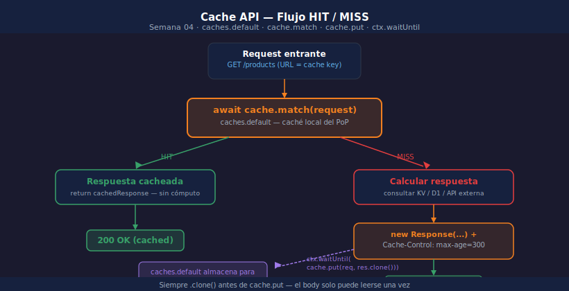

# Cache API — Caché HTTP en el Edge

> 

## Objetivos

- Usar `caches.default` para cachear respuestas HTTP en el edge
- Implementar el flujo HIT/MISS con `cache.match` y `cache.put`
- Controlar el tiempo de caché con headers `Cache-Control`
- Usar `ctx.waitUntil` para escritura asíncrona sin bloquear la respuesta

---

## 1. Cache API vs Workers KV

| Característica | Cache API | Workers KV |
|---------------|-----------|------------|
| Qué almacena | Respuestas HTTP completas | Valores arbitrarios |
| Clave | URL de la Request | String personalizado |
| TTL | Header `Cache-Control` | `expirationTtl` |
| Consistencia | Por PoP (local) | Global (eventual) |

> Usa **Cache API** para cachear respuestas HTTP construidas en el Worker.
> Usa **KV** para datos de aplicación (catálogos, sesiones, configuración).

---

## 2. Flujo HIT / MISS

```typescript
export default {
  async fetch(request: Request, env: Env, ctx: ExecutionContext): Promise<Response> {
    const cache = caches.default;

    // 1. Intentar hit en caché
    const cached = await cache.match(request);
    if (cached) return cached; // HIT — respuesta directa

    // 2. MISS → construir respuesta
    const data  = await computeExpensiveData(env);
    const response = new Response(JSON.stringify(data), {
      headers: {
        "Content-Type": "application/json",
        "Cache-Control": "public, max-age=300", // 5 minutos
      },
    });

    // 3. Guardar en caché sin bloquear la respuesta al cliente
    ctx.waitUntil(cache.put(request, response.clone()));
    return response;
  },
};
```

---

## 3. Cache-Control y max-age

El TTL de la caché se controla con el header `Cache-Control`:

```typescript
// Cachear 5 minutos
"Cache-Control": "public, max-age=300"

// Cachear 1 hora con revalidación en background
"Cache-Control": "public, max-age=3600, stale-while-revalidate=60"

// No cachear nunca
"Cache-Control": "no-store"
```

---

## 4. ctx.waitUntil — escritura en background

`cache.put()` escribe en caché de forma asíncrona. Sin `waitUntil`, la escritura
se cancela cuando el Worker termina de responder:

```typescript
// ❌ Puede cancelarse antes de completar
cache.put(request, response.clone());

// ✅ Garantiza que cache.put termina aunque la respuesta ya salió
ctx.waitUntil(cache.put(request, response.clone()));
```

> Siempre haz `.clone()` antes de pasar la response a `cache.put` — un body solo se puede leer una vez.

---

## 5. Invalidar caché manualmente

```typescript
app.delete("/cache/flush", async (c) => {
  const url     = new URL(c.req.url);
  const target  = new URL("/products", url.origin);   // URL a invalidar
  const cache   = caches.default;
  const deleted = await cache.delete(new Request(target));
  return c.json({ deleted });
});
```

---

## ✅ Checklist

- [ ] ¿Llamas `cache.match(request)` antes de calcular la respuesta?
- [ ] ¿Usas `ctx.waitUntil(cache.put(...))` para no bloquear la respuesta?
- [ ] ¿Haces `.clone()` antes de pasar la response a `cache.put`?
- [ ] ¿El header `Cache-Control` refleja el TTL correcto para tu caso de uso?

## Referencias

- [Cache API](https://developers.cloudflare.com/workers/runtime-apis/cache/)
- [ExecutionContext.waitUntil()](https://developers.cloudflare.com/workers/runtime-apis/context/#waituntil)
