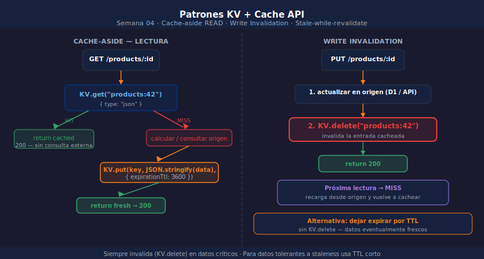

# Patrones KV + Cache API

> 

## Objetivos

- Implementar el patrón cache-aside con KV como capa de caché
- Combinar KV + Cache API para datos de aplicación y respuestas HTTP
- Invalidar entradas de forma controlada al actualizar datos
- Aplicar stale-while-revalidate para respuestas de alta disponibilidad

---

## 1. Cache-aside con KV

Cache-aside (o lazy loading) es el patrón más común con KV:
el Worker verifica KV antes de consultar la fuente original.

```typescript
app.get("/products/:id", async (c) => {
  const id  = c.req.param("id");
  const key = `products:${id}`;

  // 1. Intentar KV primero
  const cached = await c.env.KV.get(key, { type: "json" }) as Product | null;
  if (cached) return c.json({ ...cached, _source: "kv" });

  // 2. Miss → calcular / consultar fuente de datos
  const product = await fetchFromDatabase(id);
  if (!product) throw new HTTPException(404, { message: "No encontrado" });

  // 3. Guardar en KV con TTL
  await c.env.KV.put(key, JSON.stringify(product), { expirationTtl: 3600 });
  return c.json({ ...product, _source: "origin" });
});
```

---

## 2. Invalidación al escribir

Cuando un dato se actualiza, borra la entrada de KV para forzar recarga:

```typescript
app.put(
  "/products/:id",
  zValidator("json", updateSchema),
  async (c) => {
    const id      = c.req.param("id");
    const updated = c.req.valid("json");

    // Actualizar en la fuente de datos
    await saveToDatabase(id, updated);

    // Invalidar KV para que la próxima lectura recargue el dato actualizado
    await c.env.KV.delete(`products:${id}`);

    return c.json(updated);
  }
);
```

---

## 3. KV + Cache API en capas

Para máximo rendimiento, combina las dos capas:

```typescript
export default {
  async fetch(req: Request, env: Env, ctx: ExecutionContext) {
    const cache = caches.default;

    // Capa 1: Cache API (por PoP, más rápida)
    const httpCached = await cache.match(req);
    if (httpCached) return httpCached;

    // Capa 2: Workers KV (global, data layer)
    const kvData = await env.KV.get(new URL(req.url).pathname, { type: "json" });
    const body   = kvData ?? await computeData(env);

    const response = new Response(JSON.stringify(body), {
      headers: { "Content-Type": "application/json", "Cache-Control": "max-age=60" },
    });

    // Guardar en Cache API para las siguientes requests en este PoP
    ctx.waitUntil(cache.put(req, response.clone()));
    return response;
  },
};
```

---

## 4. Stale-while-revalidate

Devuelve datos cacheados (aunque obsoletos) mientras actualiza en background:

```typescript
app.get("/config", async (c) => {
  const key    = "app:config";
  const cached = await c.env.KV.get(key, { type: "json" }) as Config | null;

  if (cached) {
    // Revalidar en background sin bloquear al cliente
    c.executionCtx.waitUntil(
      fetchFreshConfig().then((cfg) =>
        c.env.KV.put(key, JSON.stringify(cfg), { expirationTtl: 300 })
      )
    );
    return c.json(cached); // devuelve inmediatamente lo que tenía
  }

  const fresh = await fetchFreshConfig();
  await c.env.KV.put(key, JSON.stringify(fresh), { expirationTtl: 300 });
  return c.json(fresh);
});
```

---

## ✅ Checklist

- [ ] ¿Implementas cache-aside: verificar KV antes de consultar la fuente?
- [ ] ¿Invalidas (borras) la entrada KV cuando el dato de origen cambia?
- [ ] ¿Usas `c.executionCtx.waitUntil` para revalidaciones en background?
- [ ] ¿Tienes TTLs distintos para datos muy leídos vs datos que cambian seguido?

## Referencias

- [KV — Use cases and best practices](https://developers.cloudflare.com/kv/concepts/how-kv-works/)
- [Cache API — Caching with Workers](https://developers.cloudflare.com/workers/examples/cache-api/)
