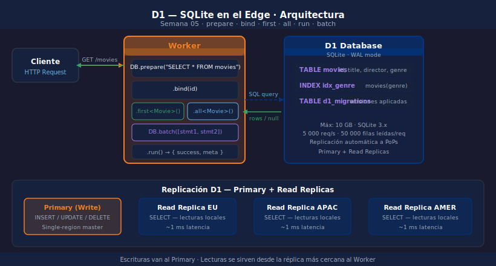

# D1 — SQLite en el Edge

> 

## Objetivos

- Entender qué es D1 y cómo se diferencia de una base de datos externa
- Crear un D1 database y declarar el binding en `wrangler.jsonc`
- Ejecutar `prepare → bind → first/all/run` contra D1 desde un Worker

## 1. Qué es D1

D1 es la base de datos SQL nativa de Cloudflare Workers.
Internamente usa **SQLite**; Cloudflare gestiona replicación y durabilidad.

| Característica | Valor |
|---------------|-------|
| Motor | SQLite 3.x |
| Tamaño máx. | 10 GB por base de datos |
| Modo WAL | Activado por defecto |
| Latencia local | ~1 ms (misma región) |

> Compatible con `nodejs_compat_v2` — no requiere drivers externos.

## 2. Binding en wrangler.jsonc

```jsonc
// wrangler.jsonc
{
  "d1_databases": [
    {
      "binding": "DB",
      "database_name": "movies-db",
      "database_id": "REPLACE_WITH_YOUR_D1_ID",
      "migrations_dir": "migrations"
    }
  ]
}
```

Crear la base de datos en Cloudflare con Wrangler:

```bash
wrangler d1 create movies-db
```

## 3. Operaciones básicas

```typescript
type Env = { DB: D1Database };

// Leer un registro por ID — siempre prepared statement
const movie = await c.env.DB
  .prepare("SELECT * FROM movies WHERE id = ?")
  .bind(id)
  .first<Movie>();                   // null si no existe

// Listar con paginación
const { results } = await c.env.DB
  .prepare("SELECT * FROM movies LIMIT ? OFFSET ?")
  .bind(limit, offset)
  .all<Movie>();                     // { results: Movie[], success: boolean }
```

## 4. INSERT y mutaciones

```typescript
// INSERT RETURNING devuelve el registro creado (SQLite 3.35+)
const created = await c.env.DB
  .prepare(
    "INSERT INTO movies (title, director, genre, year) VALUES (?, ?, ?, ?) RETURNING *"
  )
  .bind(title, director, genre, year)
  .first<Movie>();

// DELETE — usa .run() cuando no necesitas el resultado
const { success } = await c.env.DB
  .prepare("DELETE FROM movies WHERE id = ?")
  .bind(id)
  .run();
```

## 5. Tipos de resultado

| Método | Devuelve | Uso típico |
|--------|----------|------------|
| `.first<T>()` | `T \| null` | SELECT por PK |
| `.all<T>()` | `{ results: T[] }` | SELECT listados |
| `.run()` | `{ success, meta }` | INSERT/UPDATE/DELETE |

## ✅ Checklist

- [ ] ¿Cuál es el motor de base de datos que usa D1 internamente?
- [ ] ¿Qué método usas para obtener un único registro por ID?
- [ ] ¿Por qué nunca debes concatenar strings en queries D1?
- [ ] ¿Qué hace `RETURNING *` en un INSERT de SQLite?

## Referencias

- [D1 · Get started](https://developers.cloudflare.com/d1/get-started/)
- [D1 · Workers Binding API](https://developers.cloudflare.com/d1/worker-api/)
