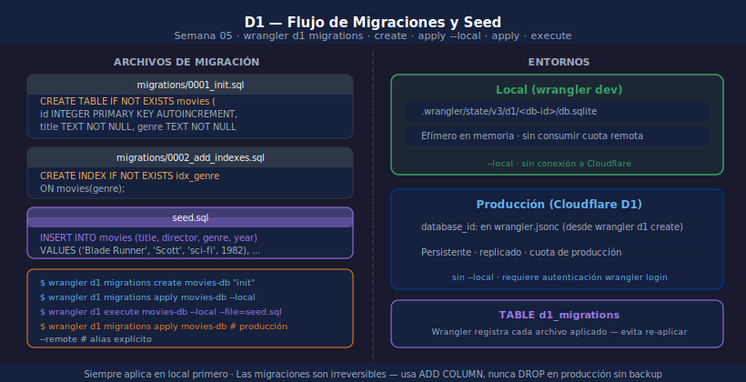

# D1 — Migraciones y Seed

> 

## Objetivos

- Crear y aplicar migraciones SQL con Wrangler CLI
- Distinguir entre entorno local y remoto al aplicar migraciones
- Cargar datos de prueba con `wrangler d1 execute`

## 1. Por qué migraciones

Las migraciones son archivos SQL versionados que describen cómo evoluciona
el schema. Sin ellas, aplicar cambios en producción es manual y propenso a
errores. Wrangler lleva un registro de cuáles se han aplicado.

```
migrations/
├── 0001_init.sql        ← create tables
└── 0002_add_rating.sql  ← alter tables
```

## 2. Crear y aplicar migraciones

```bash
# 1. Crea el archivo de migración (nombre descriptivo, no incluye fecha)
wrangler d1 migrations create movies-db "init"

# 2. Edita migrations/0001_init.sql con el CREATE TABLE

# 3. Aplica en local (SQLite local, sin consumir cuota remota)
wrangler d1 migrations apply movies-db --local

# 4. Aplica en producción Cloudflare
wrangler d1 migrations apply movies-db
```

## 3. Estructura de una migración

```sql
-- migrations/0001_init.sql
CREATE TABLE IF NOT EXISTS movies (
  id       INTEGER PRIMARY KEY AUTOINCREMENT,
  title    TEXT    NOT NULL,
  director TEXT    NOT NULL,
  genre    TEXT    NOT NULL,
  year     INTEGER NOT NULL,
  rating   REAL    DEFAULT 0,
  available INTEGER DEFAULT 1
);

CREATE INDEX IF NOT EXISTS idx_movies_genre ON movies(genre);
```

## 4. Seed con wrangler d1 execute

```bash
# Carga datos de prueba en local
wrangler d1 execute movies-db --local --file=./seed.sql

# En producción (usa con cuidado en datos críticos)
wrangler d1 execute movies-db --file=./seed.sql
```

El archivo `seed.sql` contiene `INSERT INTO` statements.
En un Worker, también puedes exponer una ruta `POST /seed` para el local dev.

## 5. Agregar columnas (segunda migración)

```sql
-- migrations/0002_add_rating.sql
ALTER TABLE movies ADD COLUMN rating REAL DEFAULT 0;
ALTER TABLE movies ADD COLUMN available INTEGER DEFAULT 1;
```

> Wrangler registra en la tabla `d1_migrations` qué archivos ya se aplicaron.

## ✅ Checklist

- [ ] ¿Qué flag distingue aplicar una migración en local vs en producción?
- [ ] ¿Qué archivo guarda el historial de migraciones aplicadas?
- [ ] ¿Qué comando carga datos desde un archivo SQL en D1 local?
- [ ] ¿Por qué usar `CREATE TABLE IF NOT EXISTS` en migraciones?

## Referencias

- [D1 · Migrations](https://developers.cloudflare.com/d1/reference/migrations/)
- [D1 · Local development](https://developers.cloudflare.com/d1/local-development/)
