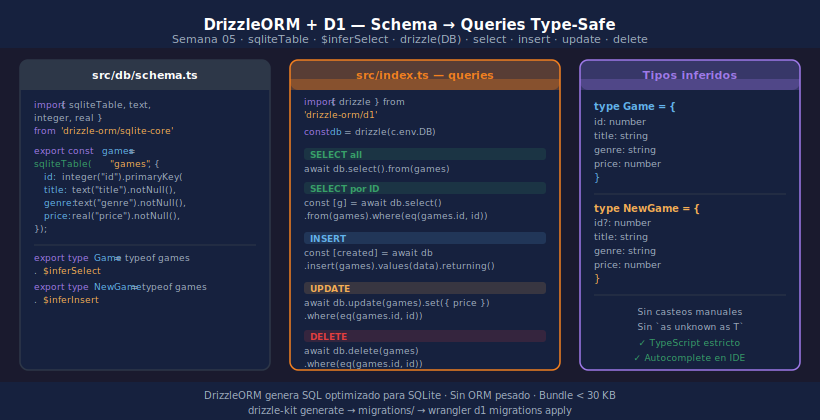

# D1 con DrizzleORM

> 

## Objetivos

- Definir un schema SQLite con `drizzle-orm/sqlite-core`
- Ejecutar queries type-safe sobre D1 desde un Worker
- Inferir tipos TypeScript automáticamente desde el schema

## 1. Instalación y setup

```bash
pnpm add drizzle-orm@0.45.2
pnpm add -D drizzle-kit@0.31.10
```

Inicializa DrizzleORM con el binding D1 de Hono:

```typescript
import { drizzle } from "drizzle-orm/d1";

// Dentro de un handler Hono
const db = drizzle(c.env.DB);
```

## 2. Definir el schema

```typescript
// src/db/schema.ts
import { sqliteTable, text, integer, real } from "drizzle-orm/sqlite-core";

export const games = sqliteTable("games", {
  id:       integer("id").primaryKey({ autoIncrement: true }),
  title:    text("title").notNull(),
  studio:   text("studio").notNull(),
  genre:    text("genre").notNull(),
  platform: text("platform").notNull(),
  year:     integer("year").notNull(),
  price:    real("price").notNull(),
  inStock:  integer("in_stock", { mode: "boolean" }).default(true),
});

// Tipos inferidos automáticamente desde el schema
export type Game       = typeof games.$inferSelect;
export type NewGame    = typeof games.$inferInsert;
```

## 3. Queries type-safe

```typescript
import { eq } from "drizzle-orm";

// SELECT all
const allGames = await db.select().from(games);

// SELECT por ID (destructuring para obtener uno)
const [game] = await db.select().from(games).where(eq(games.id, id));

// INSERT
const [created] = await db.insert(games).values(data).returning();

// UPDATE
await db.update(games).set({ price }).where(eq(games.id, id));

// DELETE
await db.delete(games).where(eq(games.id, id));
```

## 4. Generar y aplicar migraciones con drizzle-kit

```typescript
// drizzle.config.ts
import type { Config } from "drizzle-kit";

export default {
  schema:  "./src/db/schema.ts",
  out:     "./migrations",
  dialect: "sqlite",
  driver:  "d1-http",
} satisfies Config;
```

```bash
# Genera SQL desde el schema TypeScript
pnpm drizzle-kit generate

# Aplica en local
wrangler d1 migrations apply games-db --local
```

## ✅ Checklist

- [ ] ¿Qué función conecta DrizzleORM con el binding `D1Database`?
- [ ] ¿Cómo obtienes el tipo TypeScript de una fila a partir del schema?
- [ ] ¿Qué devuelve `db.insert(...).values(...).returning()`?
- [ ] ¿Qué hace `drizzle-kit generate` y dónde guarda los archivos?

## Referencias

- [DrizzleORM · D1 Get Started](https://orm.drizzle.team/docs/get-started/d1-new)
- [DrizzleORM · SQLite Schema](https://orm.drizzle.team/docs/column-types/sqlite)
