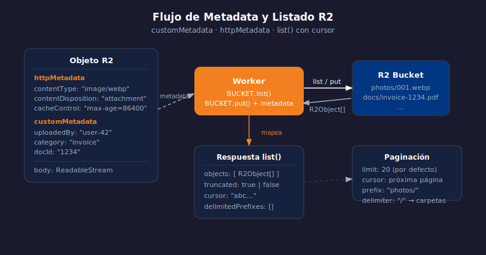

# R2 — Listado, Metadata y Reads Condicionales

> 

## Objetivos

- Listar objetos con paginación usando `list` y `cursor`
- Enriquecer objetos con `customMetadata` y `httpMetadata`
- Usar `range` y `onlyIf` para lecturas eficientes

## 1. Listar objetos — `list`

R2 no usa un modelo de directorios real, pero `list` admite prefijos y
delimitadores para simular carpetas.

```typescript
// GET /files?prefix=photos/&cursor=TOKEN_CURSOR
app.get("/files", async (c) => {
  const prefix = c.req.query("prefix");
  const cursor = c.req.query("cursor");

  const listed = await c.env.BUCKET.list({
    prefix,
    cursor,
    limit: 20,
    include: ["customMetadata", "httpMetadata"],
  });

  return c.json({
    objects:   listed.objects.map((o) => ({ key: o.key, size: o.size, metadata: o.customMetadata })),
    truncated: listed.truncated,
    cursor:    listed.truncated ? listed.cursor : undefined,
  });
});
```

> `truncated: true` significa que hay más resultados — usa el `cursor` para la siguiente página.

## 2. customMetadata

`customMetadata` permite adjuntar hasta 2 KB de pares clave-valor a un objeto.
Es útil para datos del dominio sin abrir el archivo.

```typescript
// Guarda un documento con metadata del dominio
await c.env.BUCKET.put(`docs/${id}.pdf`, body, {
  httpMetadata:   { contentType: "application/pdf" },
  customMetadata: {
    uploadedBy: userId,
    category:   "invoice",
    docId:      String(id),
  },
});
```

Para leerla al descargar:

```typescript
const object = await c.env.BUCKET.get("docs/123.pdf");
const meta   = object?.customMetadata;   // { uploadedBy, category, docId }
```

## 3. httpMetadata

`httpMetadata` mapea directamente a headers HTTP estándar que R2 reenvía al
cliente cuando se usa `writeHttpMetadata`.

| Campo | Header HTTP |
|-------|-------------|
| `contentType` | `Content-Type` |
| `contentDisposition` | `Content-Disposition` |
| `cacheControl` | `Cache-Control` |

```typescript
await c.env.BUCKET.put(key, body, {
  httpMetadata: {
    contentType:        "image/webp",
    contentDisposition: `attachment; filename="${filename}"`,
    cacheControl:       "public, max-age=31536000",
  },
});
```

## 4. Range reads y conditional reads

```typescript
// Sólo devuelve los primeros 1 MB del objeto
const partial = await c.env.BUCKET.get("video.mp4", {
  range: { offset: 0, length: 1_048_576 },
});

// onlyIf — evita transferir si el cliente ya tiene la versión en cache
const conditional = await c.env.BUCKET.get(key, {
  onlyIf: { etagMatches: c.req.header("if-none-match") },
});
if (conditional instanceof R2ObjectBody) { /* 200 */ }
// else: R2Object sin body → 304 Not Modified
```

## ✅ Checklist

- [ ] ¿Qué campo de la respuesta de `list` indica que hay más resultados?
- [ ] ¿Cuál es el límite de tamaño de `customMetadata` por objeto?
- [ ] ¿Qué header HTTP controla el `contentDisposition` en `httpMetadata`?
- [ ] ¿Para qué sirve `onlyIf: { etagMatches }` en un `get`?

## Referencias

- [R2 · list()](https://developers.cloudflare.com/r2/api/workers/workers-api-reference/#r2bucketlist)
- [R2 · Object metadata](https://developers.cloudflare.com/r2/reference/metadata-api/)
