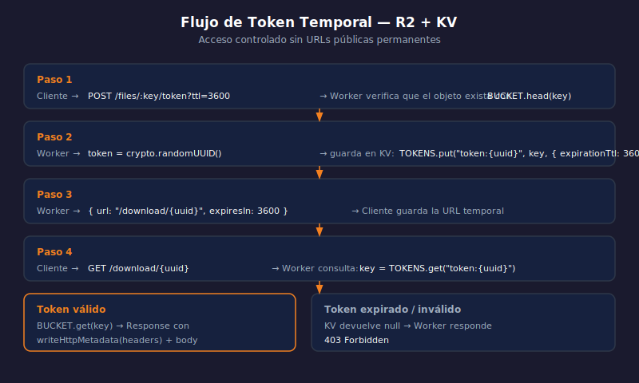

# R2 — Acceso Controlado con Tokens Temporales

> 

## Objetivos

- Entender por qué R2 no tiene URLs firmadas nativas en Workers
- Implementar acceso controlado con tokens temporales almacenados en KV
- Generar y validar tokens de descarga con TTL

## 1. El problema de URLs públicas en R2

Por defecto un bucket R2 es **privado**: solo accesible desde un Worker con
el binding. Para compartir un archivo sin hacerlo público permanente, usamos
un token temporal en KV que el Worker valida.

```
Cliente → POST /files/:key/token
Worker  → genera token → guarda en KV con TTL → devuelve URL
Cliente → GET /download/:token
Worker  → valida token en KV → sirve objeto de R2
```

## 2. Generar un token de descarga

```typescript
import { crypto } from "@cloudflare/workers-types";

type Env = { BUCKET: R2Bucket; TOKENS: KVNamespace };

// POST /files/:key/token?ttl=3600
app.post("/files/:key/token", async (c) => {
  const key = c.req.param("key");
  const ttl = Math.min(86400, Number(c.req.query("ttl") ?? "3600"));

  // Verifica que el objeto existe antes de crear el token
  const head = await c.env.BUCKET.head(key);
  if (!head) return c.notFound();

  // Token aleatorio criptográficamente seguro
  const token = crypto.randomUUID();

  // Almacena key → token con TTL en KV
  await c.env.TOKENS.put(`token:${token}`, key, { expirationTtl: ttl });

  return c.json({ url: `/download/${token}`, expiresIn: ttl });
});
```

## 3. Servir el archivo con el token

```typescript
// GET /download/:token
app.get("/download/:token", async (c) => {
  const token = c.req.param("token");

  // Valida el token en KV
  const key = await c.env.TOKENS.get(`token:${token}`);
  if (!key) {
    return c.json({ error: "Token inválido o expirado" }, 403);
  }

  const object = await c.env.BUCKET.get(key);
  if (!object) return c.notFound();

  const headers = new Headers();
  object.writeHttpMetadata(headers);
  headers.set("etag", object.httpEtag);

  return new Response(object.body, { headers });
});
```

## 4. head() — verificar sin descargar

```typescript
// head() devuelve metadata sin transferir el body — eficiente para validar existencia
const info = await c.env.BUCKET.head("video.mp4");
if (info) {
  console.log(info.size, info.etag, info.customMetadata);
}
```

> Usar `head` antes de crear tokens evita emitir URLs para objetos inexistentes.

## ✅ Checklist

- [ ] ¿Por qué R2 no tiene URLs firmadas nativas como S3 en el binding de Workers?
- [ ] ¿Qué parámetro de `KVNamespace.put` controla la expiración del token?
- [ ] ¿Qué responde el Worker si el token ya expiró o no existe?
- [ ] ¿Qué ventaja tiene usar `head()` sobre `get()` para verificar existencia?

## Referencias

- [R2 · head()](https://developers.cloudflare.com/r2/api/workers/workers-api-reference/#r2buckethead)
- [KV · Expiration TTL](https://developers.cloudflare.com/kv/api/write-key-value-pairs/#expiration-ttl)
