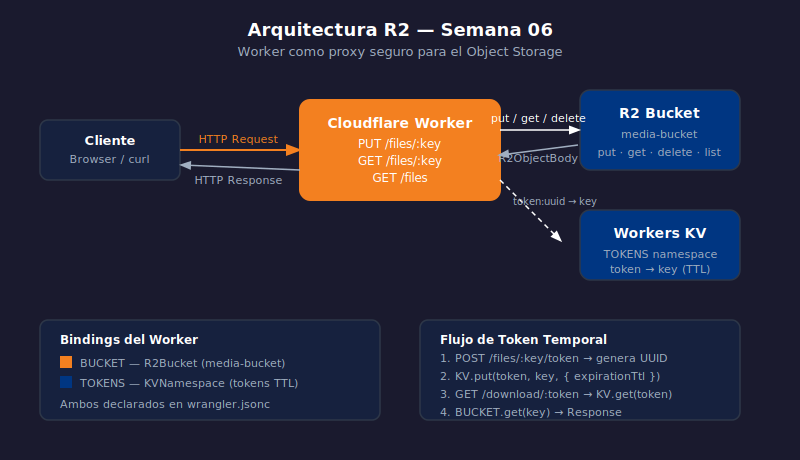

# R2 — Multipart Upload y Bucket Público

> 

## Objetivos

- Subir archivos grandes con multipart upload en tres fases
- Configurar un bucket R2 como público para acceso directo via URL
- Integrar Cache API para reducir lecturas repetidas a R2

## 1. Multipart Upload

Para archivos mayores de 50 MB es recomendable usar multipart upload.
El proceso tiene tres fases: iniciar, subir partes y completar.

```typescript
// Fase 1: Iniciar la subida
app.post("/uploads", async (c) => {
  const key    = c.req.query("key") ?? crypto.randomUUID();
  const upload = await c.env.BUCKET.createMultipartUpload(key, {
    httpMetadata: { contentType: c.req.header("content-type") ?? "application/octet-stream" },
  });
  return c.json({ uploadId: upload.uploadId, key: upload.key });
});

// Fase 2: Subir una parte (mínimo 5 MB excepto la última)
app.put("/uploads/:key/parts/:part", async (c) => {
  const { key, part } = c.req.param();
  const uploadId = c.req.query("uploadId")!;
  const upload   = c.env.BUCKET.resumeMultipartUpload(key, uploadId);
  const body     = await c.req.arrayBuffer();
  const uploaded = await upload.uploadPart(Number(part), body);
  return c.json({ etag: uploaded.etag, partNumber: uploaded.partNumber });
});
```

## 2. Completar o abortar la subida

```typescript
// Fase 3a: Completar con la lista de partes
app.post("/uploads/:key/complete", async (c) => {
  const { key } = c.req.param();
  const { uploadId, parts } = await c.req.json<{ uploadId: string; parts: R2UploadedPart[] }>();
  const upload  = c.env.BUCKET.resumeMultipartUpload(key, uploadId);
  const object  = await upload.complete(parts);
  return c.json({ key: object.key, etag: object.etag });
});

// Fase 3b: Abortar — libera las partes incompletas
app.delete("/uploads/:key", async (c) => {
  const { key } = c.req.param();
  const uploadId = c.req.query("uploadId")!;
  const upload   = c.env.BUCKET.resumeMultipartUpload(key, uploadId);
  await upload.abort();
  return c.body(null, 204);
});
```

## 3. Bucket público

Un bucket marcado como público expone sus objetos en una URL fija sin pasar
por un Worker. Útil para assets estáticos (imágenes, CSS, fuentes).

```bash
# Habilita acceso público al bucket (requiere dominio configurado)
wrangler r2 bucket update media-bucket --public
```

URL pública resultante: `https://pub-<id>.r2.dev/<key>`

> ⚠️ Bucket público = todos los objetos son accesibles sin autenticación.
> Usar solo para assets que deben ser públicos (logos, imágenes de producto).

## 4. Cache API como capa frente a R2

```typescript
// Evita leer R2 si el objeto ya está en cache del edge
app.get("/assets/:key", async (c) => {
  const cache    = caches.default;
  const cacheKey = new Request(c.req.url);
  const cached   = await cache.match(cacheKey);
  if (cached) return cached;

  const object = await c.env.BUCKET.get(c.req.param("key"));
  if (!object) return c.notFound();

  const headers = new Headers();
  object.writeHttpMetadata(headers);
  headers.set("cache-control", "public, max-age=86400");

  const response = new Response(object.body, { headers });
  c.executionCtx.waitUntil(cache.put(cacheKey, response.clone()));
  return response;
});
```

## ✅ Checklist

- [ ] ¿Cuál es el tamaño mínimo de cada parte en un multipart upload (excepto la última)?
- [ ] ¿Qué sucede si no llamas a `complete` ni `abort` en un multipart upload?
- [ ] ¿Qué tipo de contenido es apropiado para un bucket público?
- [ ] ¿Qué hace `waitUntil` en el ejemplo de Cache API?

## Referencias

- [R2 · Multipart upload](https://developers.cloudflare.com/r2/api/workers/workers-api-reference/#r2bucketcreatemultipartupload)
- [R2 · Public buckets](https://developers.cloudflare.com/r2/buckets/public-buckets/)
