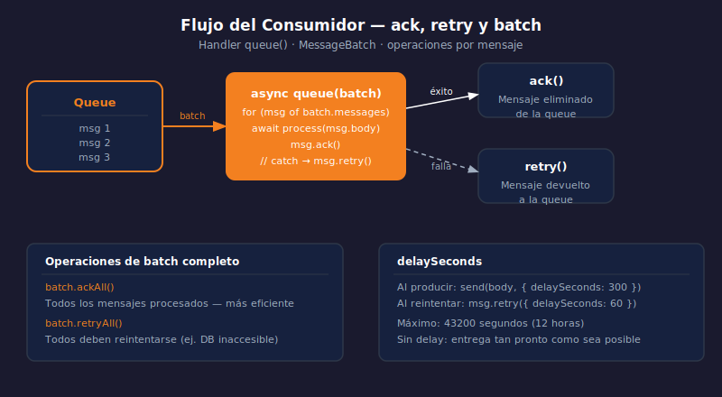

# Queues — El Consumidor y el Handler `queue`

> 

## Objetivos

- Implementar el handler `queue` para procesar mensajes
- Usar `ack()`, `retry()`, `ackAll()` y `retryAll()` correctamente
- Manejar errores dentro del batch sin perder mensajes

## 1. El handler `queue`

El consumidor se declara exportando un objeto con el método `queue`.
Cloudflare lo invoca automáticamente cuando hay mensajes pendientes.

```typescript
// src/index.ts — Worker consumidor
export default {
  // Handler HTTP (opcional en el mismo Worker)
  async fetch(_req: Request): Promise<Response> {
    return new Response("ok");
  },

  // Handler de Queue — recibe un batch de mensajes
  async queue(batch: MessageBatch<EventPayload>, env: Env): Promise<void> {
    for (const message of batch.messages) {
      console.log("Procesando:", message.body);
      message.ack();   // marca como procesado con éxito
    }
  },
};
```

## 2. ack, retry y operaciones de batch

```typescript
async queue(batch: MessageBatch<OrderEvent>, env: Env): Promise<void> {
  for (const message of batch.messages) {
    try {
      await processOrder(message.body, env);
      message.ack();      // éxito — no se reintentará
    } catch (err) {
      message.retry();    // falla — se reintentará según max_retries
    }
  }
}
```

Métodos de batch completo (más eficientes cuando todos o ninguno deben fallar):

```typescript
// Todos procesados correctamente
batch.ackAll();

// Todos deben reintentarse (ej. error de conexión a DB)
batch.retryAll();
```

## 3. delaySeconds — retrasar reintentos

```typescript
// Reintenta el mensaje pero con un delay de 60 segundos
message.retry({ delaySeconds: 60 });

// También al producir — retrasa la primera entrega
await env.MY_QUEUE.send(body, { delaySeconds: 300 });
```

> `delaySeconds` acepta hasta 43200 (12 horas).

## 4. Tipo del batch y metadata

```typescript
async queue(batch: MessageBatch<MyPayload>, env: Env): Promise<void> {
  console.log("Queue:", batch.queue);          // nombre de la queue
  console.log("Mensajes:", batch.messages.length);

  for (const msg of batch.messages) {
    console.log("ID:", msg.id);                // ID único del mensaje
    console.log("Timestamp:", msg.timestamp);  // Date de encolado
    console.log("Body:", msg.body);            // payload deserializado
    msg.ack();
  }
}
```

## 5. Patrón recomendado: ack individual + catch

```typescript
// Procesa cada mensaje independientemente — evita que un error bloquee el batch
async queue(batch: MessageBatch<Notification>, env: Env): Promise<void> {
  const results = await Promise.allSettled(
    batch.messages.map(async (msg) => {
      await sendNotification(msg.body, env);
      msg.ack();
    })
  );
  // Los mensajes sin ack se reintentan automáticamente
}
```

## ✅ Checklist

- [ ] ¿Qué pasa con un mensaje si el handler `queue` lanza una excepción sin hacer `ack`?
- [ ] ¿Cuándo usarías `batch.retryAll()` en lugar de `message.retry()` individual?
- [ ] ¿Qué propiedad del mensaje indica cuándo fue encolado?
- [ ] ¿Qué valor de `delaySeconds` se puede aplicar al producir un mensaje?

## Referencias

- [Queues · Consumer](https://developers.cloudflare.com/queues/configuration/consumer-concurrency/)
- [Queues · Batching](https://developers.cloudflare.com/queues/configuration/batching-retries/)
