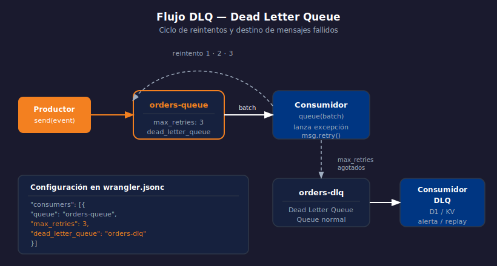

# Queues — Dead Letter Queue y Reintentos

> 

## Objetivos

- Configurar el número máximo de reintentos por mensaje
- Entender qué es la Dead Letter Queue (DLQ) y cómo configurarla
- Implementar logging y alertas basados en mensajes en la DLQ

## 1. Ciclo de vida de un mensaje fallido

Cuando un mensaje no recibe `ack`, Cloudflare lo reintenta hasta
`max_retries` veces. Si sigue fallando, va a la **Dead Letter Queue**.

```
Productor → Queue → Consumidor [falla] → reintento 1 → reintento 2 →
  reintento max_retries → DLQ
```

## 2. Configurar reintentos y DLQ

```jsonc
// wrangler.jsonc
{
  "queues": {
    "producers": [
      { "queue": "orders-queue",   "binding": "ORDERS_QUEUE" },
      { "queue": "orders-dlq",     "binding": "ORDERS_DLQ" }
    ],
    "consumers": [
      {
        "queue": "orders-queue",
        "max_batch_size":    10,
        "max_batch_timeout": 5,
        "max_retries":       3,
        "dead_letter_queue": "orders-dlq"
      }
    ]
  }
}
```

> La DLQ es otra Queue normal — necesitas crear `orders-dlq` con Wrangler también.

## 3. Consumidor de la DLQ

```bash
wrangler queues create orders-dlq
```

```typescript
// Handler de la DLQ — para auditoría y alertas
export default {
  async queue(batch: MessageBatch<FailedOrderEvent>, env: Env): Promise<void> {
    for (const message of batch.messages) {
      // Guarda en D1 para auditoría
      await env.DB.prepare(
        "INSERT INTO failed_events (payload, failed_at) VALUES (?, ?)"
      )
        .bind(JSON.stringify(message.body), new Date().toISOString())
        .run();

      // O envía una alerta (webhook, KV flag, etc.)
      message.ack();
    }
  },
};
```

## 4. Inspeccionar mensajes en la DLQ con Wrangler

```bash
# Ver cuántos mensajes están en la DLQ
wrangler queues info orders-dlq

# Tail del consumidor de la DLQ en tiempo real
wrangler tail orders-dlq-consumer
```

## 5. Evitar acumulación en la DLQ

| Estrategia | Implementación |
|-----------|---------------|
| Idempotencia | Guardar `msg.id` en KV antes de procesar |
| Circuit breaker | Si DLQ > threshold → parar productor |
| Replayability | DLQ consumidor reencola a la queue original |

```typescript
// Reencolar desde DLQ (manual replay)
async queue(batch: MessageBatch<OrderEvent>, env: Env): Promise<void> {
  const retryable = batch.messages.filter((m) => shouldRetry(m.body));
  await env.ORDERS_QUEUE.sendBatch(retryable.map((m) => ({ body: m.body })));
  batch.ackAll();
}
```

## ✅ Checklist

- [ ] ¿Qué ocurre con un mensaje cuando supera `max_retries` sin recibir `ack`?
- [ ] ¿Cómo se declara la DLQ en el `wrangler.jsonc`?
- [ ] ¿Por qué es importante guardar `msg.id` antes de procesar un mensaje?
- [ ] ¿Cómo puedes ver mensajes en la DLQ sin un consumidor activo?

## Referencias

- [Queues · Dead Letter Queues](https://developers.cloudflare.com/queues/configuration/dead-letter-queues/)
- [Queues · Retries](https://developers.cloudflare.com/queues/configuration/batching-retries/#retries)
