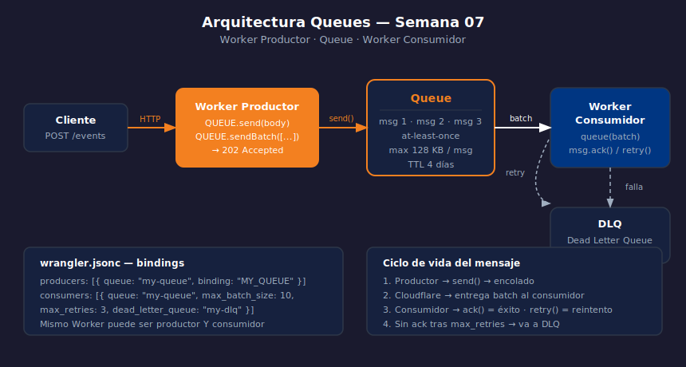

# Queues — Patrones Fan-out y Pipelines

> 

## Objetivos

- Implementar fan-out enviando un evento a múltiples Queues
- Encadenar Workers en un pipeline asíncrono de procesamiento
- Combinar Queues con D1 o KV para persistir resultados

## 1. Fan-out — un evento, múltiples consumidores

Fan-out es enviar el mismo mensaje a N Queues diferentes, cada una con
su propio consumidor especializado.

```typescript
type Env = {
  EMAIL_QUEUE:     Queue;
  ANALYTICS_QUEUE: Queue;
  AUDIT_QUEUE:     Queue;
};

// Un evento de registro dispara tres acciones paralelas
app.post("/users/register", async (c) => {
  const user = await c.req.json<{ id: string; email: string }>();

  // Envío paralelo a tres queues distintas
  await Promise.all([
    c.env.EMAIL_QUEUE.send({ type: "welcome",   userId: user.id, email: user.email }),
    c.env.ANALYTICS_QUEUE.send({ event: "signup", userId: user.id }),
    c.env.AUDIT_QUEUE.send({ action: "user_created", userId: user.id }),
  ]);

  return c.json({ registered: true }, 201);
});
```

## 2. Pipeline — encadenado de Queues

Un consumidor puede actuar como productor de la siguiente Queue,
creando un pipeline de procesamiento en etapas.

```
HTTP → Queue A → Worker A (enriquece) → Queue B → Worker B (persiste)
```

```typescript
// Worker A — consume Queue A y produce a Queue B
export default {
  async queue(batch: MessageBatch<RawOrder>, env: Env): Promise<void> {
    for (const msg of batch.messages) {
      const enriched = await enrichOrder(msg.body, env);  // llama API externa
      await env.ENRICHED_QUEUE.send(enriched);            // pasa al siguiente stage
      msg.ack();
    }
  },
};
```

## 3. Integración con D1 — persistir desde el consumidor

```typescript
// Consumidor que guarda cada mensaje en D1
async queue(batch: MessageBatch<OrderEvent>, env: Env): Promise<void> {
  // Procesa todos en paralelo; falla individualmente si hay error
  await Promise.all(
    batch.messages.map(async (msg) => {
      const { orderId, amount, status } = msg.body;
      await env.DB.prepare(
        "INSERT INTO orders (id, amount, status, created_at) VALUES (?, ?, ?, ?)"
      )
        .bind(orderId, amount, status, new Date().toISOString())
        .run();
      msg.ack();
    })
  );
}
```

## 4. Cuándo usar Queues vs llamada directa

| Escenario | Queues | Llamada directa |
|-----------|--------|-----------------|
| API externa lenta (> 500 ms) | ✅ | ❌ |
| Respuesta inmediata al usuario | ❌ | ✅ |
| Reintento automático necesario | ✅ | ❌ |
| Procesamiento en batch eficiente | ✅ | ❌ |

## ✅ Checklist

- [ ] ¿Qué ventaja tiene fan-out frente a llamar N servicios desde un solo Worker?
- [ ] ¿Cómo se convierte un consumidor en productor dentro de un pipeline?
- [ ] ¿Por qué usarías `Promise.all` en el handler `queue` en lugar de un `for` secuencial?
- [ ] ¿En qué casos conviene una llamada directa en lugar de una Queue?

## Referencias

- [Queues · Configuration](https://developers.cloudflare.com/queues/configuration/)
- [Queues · Examples — Fan-out](https://developers.cloudflare.com/queues/examples/)
