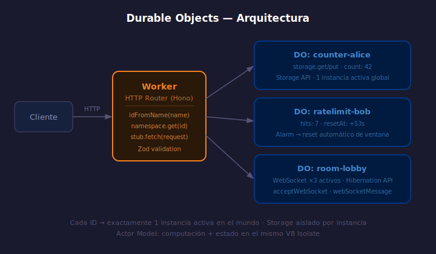

# Durable Objects — El Modelo de Actor

> 

## Objetivos

- Entender el modelo de actor y qué hace único a un Durable Object
- Declarar un DO en `wrangler.jsonc` con bindings y migrations
- Obtener una instancia por nombre y enrutar peticiones HTTP al DO

## 1. Qué es un Durable Object

Un Durable Object (DO) combina **computación** y **estado persistente** en un
solo V8 Isolate — garantizando que solo existe **una instancia activa en el
mundo** para cada ID único. Esto elimina condiciones de carrera sin locks.

| Característica | Workers normales | Durable Object |
|----------------|-----------------|----------------|
| Estado entre requests | ❌ Efímero | ✅ Persistente |
| Instancias activas | Muchas en paralelo | **1 por ID** |
| Ideal para | APIs stateless | Contadores, sesiones, locks |

## 2. Declarar el DO en wrangler.jsonc

```jsonc
{
  "durable_objects": {
    "bindings": [
      { "name": "COUNTER_DO", "class_name": "CounterDO" }
    ]
  },
  "migrations": [
    { "tag": "v1", "new_classes": ["CounterDO"] }
  ]
}
```

> `migrations` es **obligatorio** para que Cloudflare aprovisione el almacenamiento.

## 3. Estructura de la clase DO

```typescript
export class CounterDO implements DurableObject {
  private storage: DurableObjectStorage;

  constructor(state: DurableObjectState, _env: Env) {
    // state.storage persiste entre invocaciones
    this.storage = state.storage;
  }

  async fetch(request: Request): Promise<Response> {
    const url = new URL(request.url);

    if (url.pathname === "/increment") {
      const count = ((await this.storage.get<number>("count")) ?? 0) + 1;
      await this.storage.put("count", count);
      return Response.json({ count });
    }

    const count = (await this.storage.get<number>("count")) ?? 0;
    return Response.json({ count });
  }
}
```

## 4. Obtener una instancia desde el Worker

```typescript
type Env = { COUNTER_DO: DurableObjectNamespace };

app.get("/counter/:name", async (c) => {
  // idFromName es determinístico — mismo nombre = mismo ID siempre
  const id = c.env.COUNTER_DO.idFromName(c.req.param("name"));
  const stub = c.env.COUNTER_DO.get(id);

  // stub.fetch enruta la petición al DO; la URL base es arbitraria
  const res = await stub.fetch("https://do/");
  return c.json(await res.json());
});
```

> `idFromName(name)` es **determinístico** y **consistente globalmente**.

## ✅ Checklist

- [ ] ¿Qué garantiza Cloudflare sobre la cantidad de instancias activas para un ID de DO?
- [ ] ¿Para qué sirve el campo `migrations` en `wrangler.jsonc`?
- [ ] ¿Cómo se obtiene siempre la misma instancia de DO para un recurso concreto?
- [ ] ¿Cuándo conviene un DO en lugar de Workers KV?

## Referencias

- [Durable Objects · Overview](https://developers.cloudflare.com/durable-objects/)
- [Durable Objects · Get started](https://developers.cloudflare.com/durable-objects/get-started/)
