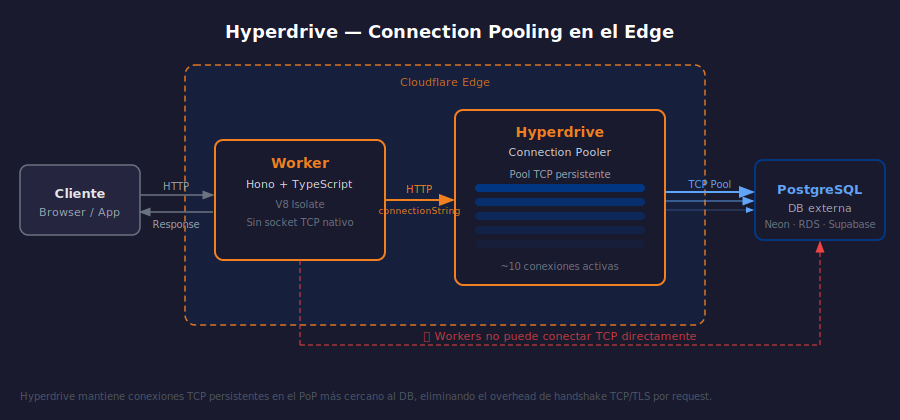

# Hyperdrive — El Problema TCP y Connection Pooling

> 

## Objetivos

- Entender por qué los Workers no pueden conectarse directamente a PostgreSQL
- Describir cómo Hyperdrive actúa como proxy de pooling en el edge
- Identificar los beneficios de latencia y conexiones de Hyperdrive

## 1. Por qué los Workers no conectan a PostgreSQL directamente

Los V8 Isolates no admiten **sockets TCP** — solo soportan HTTP y WebSockets.
PostgreSQL usa el protocolo wire sobre TCP, lo que hace imposible una conexión
directa desde un Worker sin una capa intermedia.

Además, cada invocación de Worker puede crear una conexión nueva:

| Problema | Impacto |
|----------|---------|
| Sin TCP nativo | Workers no puede hablar el wire protocol de Postgres |
| Conexiones efímeras | Cada request abre y cierra una conexión (lento) |
| Límite de conexiones | PostgreSQL tiene máx ~100–500 simultáneas |

## 2. Qué es Hyperdrive

Hyperdrive es un **proxy de pooling de conexiones** gestionado por Cloudflare
que vive en el edge, cerca de la base de datos. Mantiene un pool de conexiones
TCP persistentes hacia el DB, y el Worker habla HTTP hacia Hyperdrive.

```
Cliente → Worker → Hyperdrive → PostgreSQL (TCP pool)
```

Cloudflare posiciona Hyperdrive en el PoP más cercano a la base de datos,
no al usuario — porque la conexión de larga vida TCP debe estar cerca del DB.

## 3. Beneficios clave

- **Conexiones reutilizadas**: Hyperdrive mantiene ~10 conexiones TCP persistentes
- **Latencia reducida**: El handshake TCP/TLS ocurre una sola vez por conexión pooled
- **Sin límite hit**: Miles de Workers comparten el pool de Hyperdrive
- **Protocolo transparente**: El driver recibe un connection string estándar PostgreSQL

## 4. Bases de datos compatibles

Hyperdrive soporta cualquier base de datos con protocolo PostgreSQL o MySQL:

- **PostgreSQL** 12+: Neon, Supabase, AWS RDS, Google Cloud SQL, self-hosted
- **MySQL / PlanetScale**: Compatible desde 2024
- **CockroachDB**: Compatible con el driver PostgreSQL

## ✅ Checklist

- [ ] ¿Por qué un Worker no puede usar `pg.connect()` directamente?
- [ ] ¿Qué hace diferente a Hyperdrive de conectarse a un DB via REST API?
- [ ] ¿Cuántas conexiones TCP mantiene Hyperdrive hacia el DB?
- [ ] ¿El PoP de Hyperdrive se posiciona cerca del usuario o del DB?

## Referencias

- [Hyperdrive · Overview](https://developers.cloudflare.com/hyperdrive/)
- [How Hyperdrive works](https://developers.cloudflare.com/hyperdrive/configuration/how-hyperdrive-works/)
